---
## Front matter
title: "Отчёт по лабораторной работе №2"
subtitle: "Система контроля версий Git"
author: "Мальянц В. К."

## Generic otions
lang: ru-RU
toc-title: "Содержание"

## Bibliography
bibliography: bib/cite.bib
csl: pandoc/csl/gost-r-7-0-5-2008-numeric.csl

## Pdf output format
toc: true # Table of contents
toc-depth: 2
lof: true # List of figures
lot: true # List of tables
fontsize: 12pt
linestretch: 1.5
papersize: a4
documentclass: scrreprt
## I18n polyglossia
polyglossia-lang:
  name: russian
  options:
	- spelling=modern
	- babelshorthands=true
polyglossia-otherlangs:
  name: english
## I18n babel
babel-lang: russian
babel-otherlangs: english
## Fonts
mainfont: IBM Plex Serif
romanfont: IBM Plex Serif
sansfont: IBM Plex Sans
monofont: IBM Plex Mono
mathfont: STIX Two Math
mainfontoptions: Ligatures=Common,Ligatures=TeX,Scale=0.94
romanfontoptions: Ligatures=Common,Ligatures=TeX,Scale=0.94
sansfontoptions: Ligatures=Common,Ligatures=TeX,Scale=MatchLowercase,Scale=0.94
monofontoptions: Scale=MatchLowercase,Scale=0.94,FakeStretch=0.9
mathfontoptions:
## Biblatex
biblatex: true
biblio-style: "gost-numeric"
biblatexoptions:
  - parentracker=true
  - backend=biber
  - hyperref=auto
  - language=auto
  - autolang=other*
  - citestyle=gost-numeric
## Pandoc-crossref LaTeX customization
figureTitle: "Рис."
tableTitle: "Таблица"
listingTitle: "Листинг"
lofTitle: "Список иллюстраций"
lotTitle: "Список таблиц"
lolTitle: "Листинги"
## Misc options
indent: true
header-includes:
  - \usepackage{indentfirst}
  - \usepackage{float} # keep figures where there are in the text
  - \floatplacement{figure}{H} # keep figures where there are in the text
---

# Цель работы
Изучение идеологии применения средств контроля версий.
Приобретение практических навыков о работе с системой git.

# Задание
4.1 Настройка github.
4.2 Базовая настройка git.
4.3 Создание SSH-ключа.
4.4 Создание рабочего пространства и репозитория курса на основе шаблона.
4.5 Создание репозитория курса на основе шаблона.
4.6 Настройка каталога курса.
4.7 Выполнение заданий для самостоятельной работы.

# Теоретическое введение
Системы контроля версий (Version Control System, VCS) применяются
при работе нескольких человек над одним проектом. Обычно основное
дерево проекта хранится в локальном или удалённом репозитории, к
которому настроен доступ для участников проекта. При внесении изменений
в содержание проекта система контроля версий позволяет их фиксировать,
совмещать изменения, произведённые разными участниками проекта,
производить откат к любой более ранней версии проекта, если это требуется.
В классических системах контроля версий используется
централизованная модель, предполагающая наличие единого репозитория
для хранения файлов. Выполнение большинства функций по управлению
версиями осуществляется специальным сервером. Участник проекта
(пользователь) перед началом работы посредством определённых команд
получает нужную ему версию файлов. После внесения изменений,
пользователь размещает новую версию в хранилище. При этом предыдущие
версии не удаляются из центрального хранилища и к ним можно вернуться в
любой момент. Сервер может сохранять не полную версию изменённых
файлов, а производить так называемую дельта-компрессию — сохранять
только изменения между последовательными версиями, что позволяет
уменьшить объём хранимых данных.
Системы контроля версий поддерживают возможность отслеживания и
разрешения конфликтов, которые могут возникнуть при работе нескольких
человек над одним файлом. Можно объединить (слить) изменения,
сделанные разными участниками (автоматически или вручную), вручную
выбрать нужную версию, отменить изменения вовсе или заблокировать
файлы для изменения. В зависимости от настроек блокировка не позволяет
другим пользователям получить рабочую копию или препятствует
изменению рабочей копии файла средствами файловой системы ОС,
обеспечивая таким образом, привилегированный доступ только одному
пользователю, работающему с файлом.
7Системы контроля версий также могут обеспечивать дополнительные,
более гибкие функциональные возможности. Например, они могут
поддерживать работу с несколькими версиями одного файла, сохраняя
общую историю изменений до точки ветвления версий и собственные
истории изменений каждой ветви. Кроме того, обычно доступна информация
о том, кто из участников, когда и какие изменения вносил. Обычно такого
рода информация хранится в журнале изменений, доступ к которому можно
ограничить.
В отличие от классических, в распределённых системах контроля
версий центральный репозиторий не является обязательным.
Среди классических VCS наиболее известны CVS, Subversion, а среди
распределённых — Git, Bazaar, Mercurial. Принципы их работы схожи,
отличаются они в основном синтаксисом используемых в работе команд.

# Выполнение лабораторной работы
## Настройка github
Создала учетную запись на сайте https://github.com/ и заполнила свои данные (рис.[-@fig:001]).

{#fig:001 width=70%}

## Базовая настройка git
Открываю терминал и делаю предварительную конфигурацию git. Ввожу команды:
git config --global user.name "" и указываю в ней имя владельца репозитория (свое
имя), git config --global user.email "" и указываю в ней почту владельца репозитория
(свою почту) (рис. [-@fig:002]) (рис. [-@fig:003]).

{#fig:002 width=70%}

{#fig:003 width=70%}

Настраиваю utf-8 в выводе сообщений git (рис. [-@fig:004]).

{#fig:004 width=70%}

Задаю имя начальной ветки, называю ее master (рис. [-@fig:005]).

{#fig:005 width=70%}

Параметр autocrlf (рис. [-@fig:006]).

{#fig:006 width=70%}

Параметр safecrlf (рис. [-@fig:007]).

{#fig:007 width=70%}

## Создание SSH ключа
Генерирую пару ключей для идентификации пользователя на сервере репозиториев
(рис. [-@fig:008]).

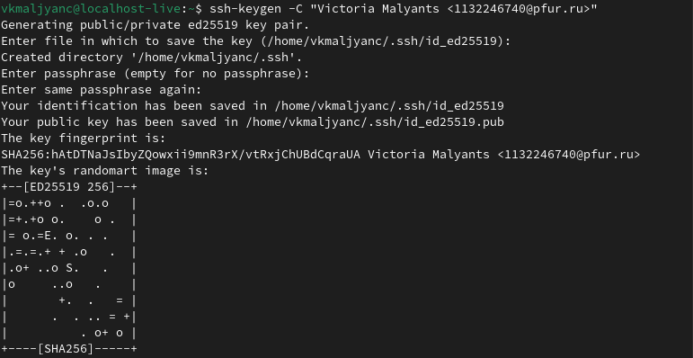{#fig:008 width=70%}

Вывожу содержимое файла с открытым ключом с помощью команды cat (рис. [-@fig:009]).

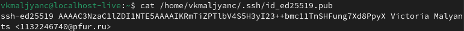{#fig:009 width=70%}

Вставляю ключ в окно New SSH key, указываю имя ключа (рис. [-@fig:010]).

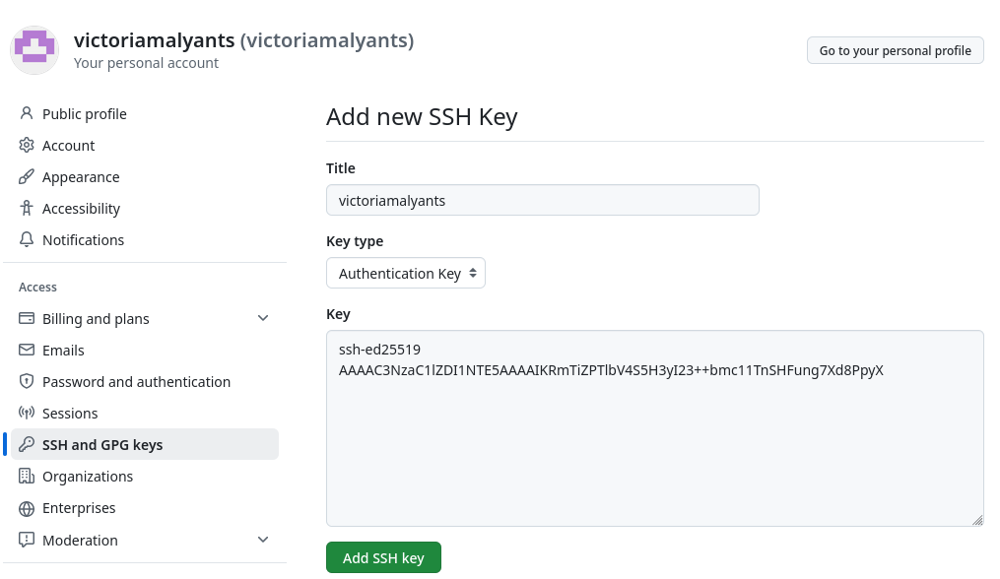{#fig:010 width=70%}

Убеждаюсь в том, что SSH key создан (рис. [-@fig:011]).

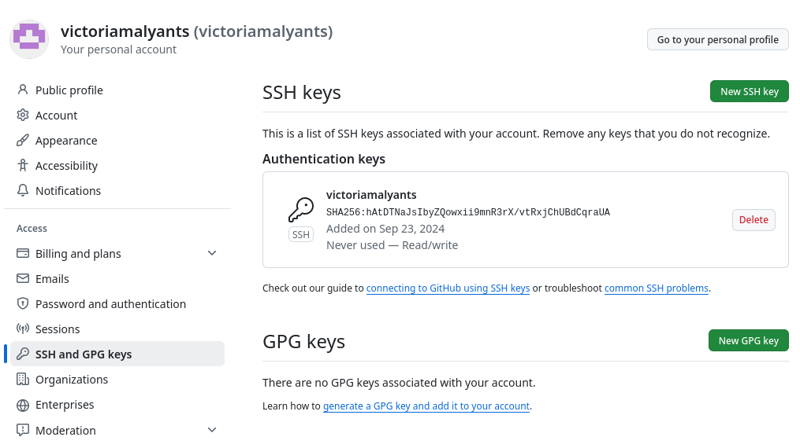{#fig:011 width=70%}

## Создание рабочего пространства и репозитория курса на основе шаблона
Создаю каталог для предмета «Архитектура компьютера» с помощью mkdir -p (рис. [-@fig:012]).

{#fig:012 width=70%}

## Создание репозитория курса на основе шаблона
Перехожу на страницу репозитория с шаблоном курса
https://github.com/yamadharma/course-directory-student-template. Задаю имя
репозитория и создаю его (рис. [-@fig:013]) (рис. [-@fig:014]).

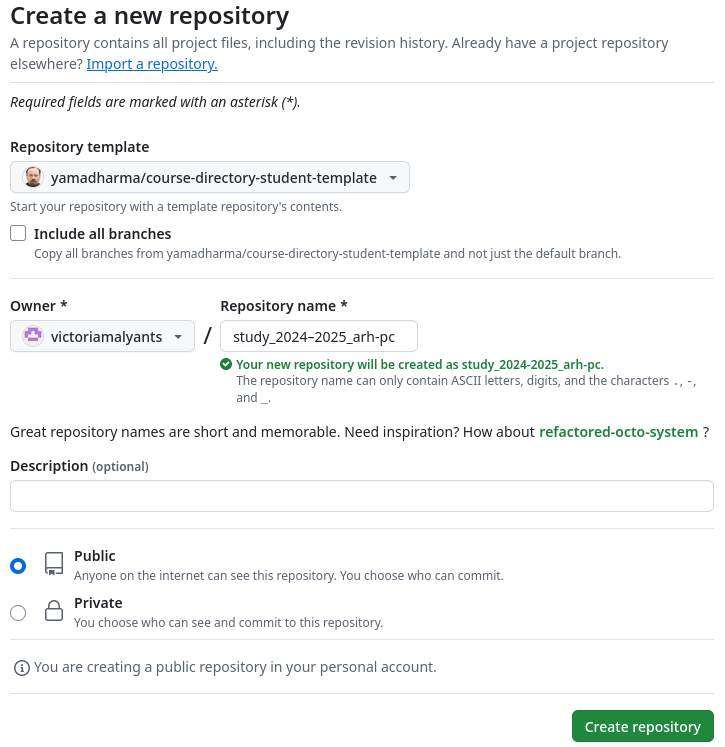{#fig:013 width=70%}

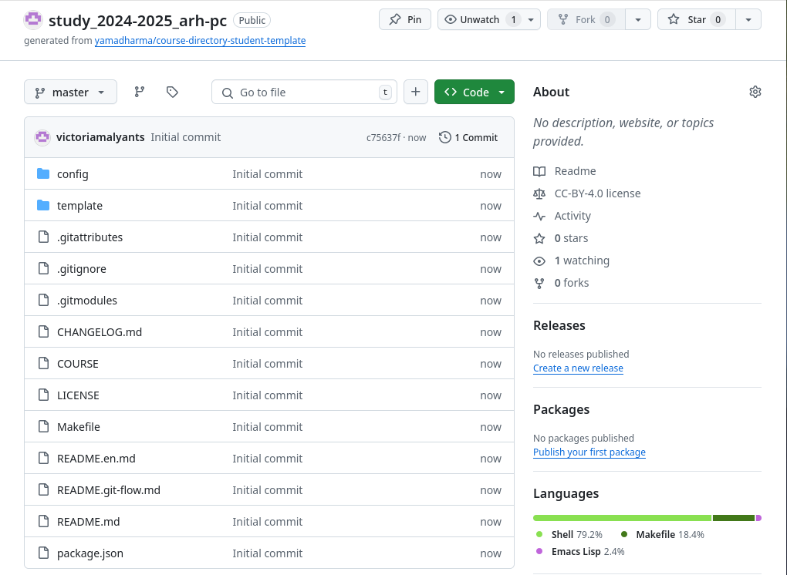{#fig:014 width=70%}

Перехожу в каталог курса с помощью команды cd (рис. [-@fig:015]).

{#fig:015 width=70%}

Клонирую созданный репозиторий (рис. [-@fig:016]).

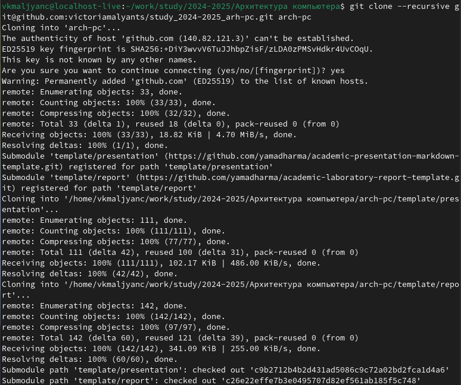{#fig:016 width=70%}

Ссылку для клонирования копирую на странице созданного репозитория (рис. [-@fig:017]).

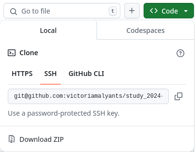{#fig:017 width=70%}

## Настройка каталога курса
Перехожу в каталог курса (рис. [-@fig:018]).

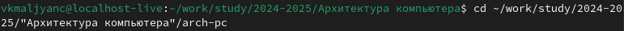{#fig:018 width=70%}

Удаляю лишние файлы (рис. [-@fig:019]).

{#fig:019 width=70%}

Создаю необходимые каталоги (рис. [-@fig:020]).

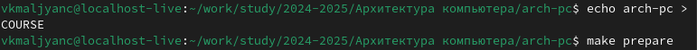{#fig:020 width=70%}

Отправляю файлы на сервер (рис. [-@fig:021]) (рис. [-@fig:022]).

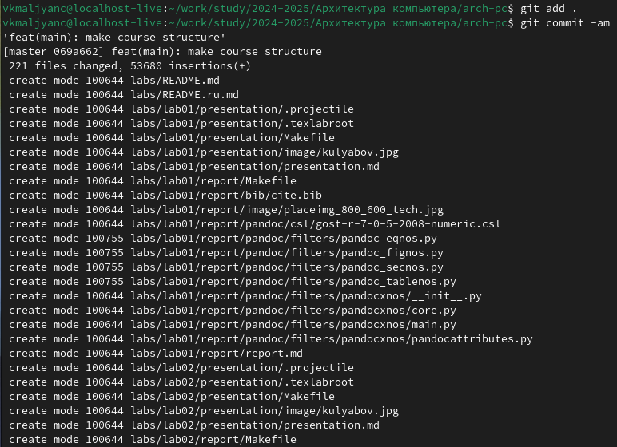{#fig:021 width=70%}

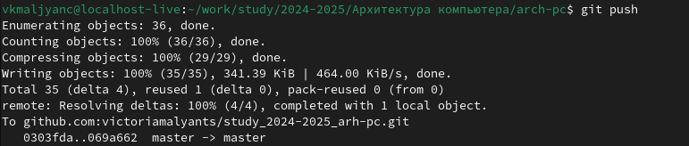{#fig:022 width=70%}

Убеждаюсь в правильности создания иерархии рабочего пространства (рис. [-@fig:023]).

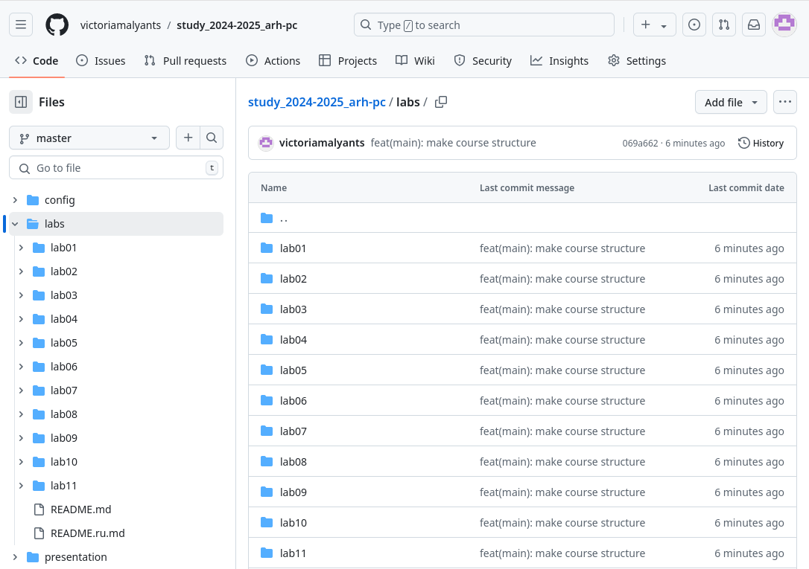{#fig:023 width=70%}

## Выполнение заданий для самостоятельной работы (рис. [-@fig:024]) (рис. [-@fig:025])

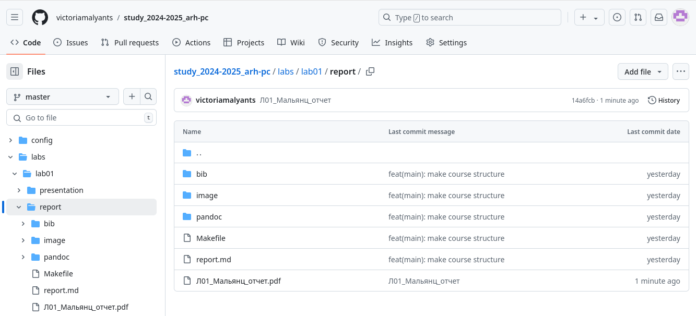{#fig:024 width=70%}

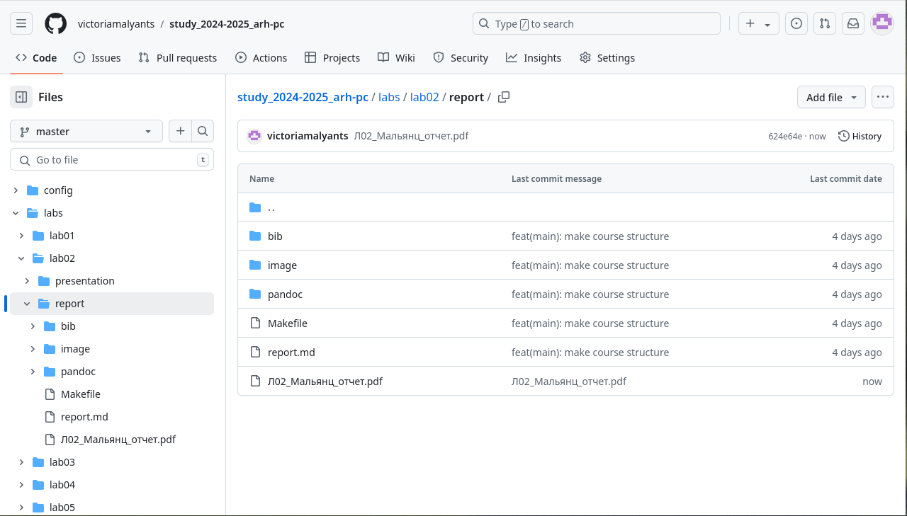{#fig:025 width=70%}

# Вывод
Я изучила идеологию и применение средств контроля версий и
приобрела практические навыки по работе с системой git.

# Список литературы
1. GDB: The GNU Project Debugger. — URL:
https://www.gnu.org/software/gdb/.
2. GNU Bash Manual. — 2016. — URL:
https://www.gnu.org/software/bash/manual/.
3. Midnight Commander Development Center. — 2021. — URL:
https://midnight-commander. org/.
4. NASM Assembly Language Tutorials. — 2021. — URL:
https://asmtutor.com/.
5. Newham C. Learning the bash Shell: Unix Shell Programming. —
O’Reilly Media, 2005. — 354 с. — (In a Nutshell). — ISBN 0596009658. —
URL: http://www.amazon.com/Learningbash-Shell-Programming-
Nutshell/dp/0596009658.
6. Robbins A. Bash Pocket Reference. — O’Reilly Media, 2016. — 156 с.
— ISBN 978-1491941591.
7. The NASM documentation. — 2021. — URL:
https://www.nasm.us/docs.php.
8. Zarrelli G. Mastering Bash. — Packt Publishing, 2017. — 502 с. —
ISBN 9781784396879.
9. Колдаев В. Д., Лупин С. А. Архитектура ЭВМ. — М. : Форум, 2018.
10. Куляс О. Л., Никитин К. А. Курс программирования на
ASSEMBLER. — М. : Солон-Пресс, 2017.
11. Новожилов О. П. Архитектура ЭВМ и систем. — М. : Юрайт, 2016.
12. Расширенный ассемблер: NASM. — 2021. — URL:
https://www.opennet.ru/docs/RUS/nasm/.
2013. Робачевский А., Немнюгин С., Стесик О. Операционная система
UNIX. — 2-е изд. — БХВПетербург, 2010. — 656 с. — ISBN 978-5-94157-
538-1.
14. Столяров А. Программирование на языке ассемблера NASM для
ОС Unix. — 2-е изд. — М. : МАКС Пресс, 2011. — URL:
http://www.stolyarov.info/books/asm_unix.
15. Таненбаум Э. Архитектура компьютера. — 6-е изд. — СПб. :
Питер, 2013. — 874 с. — (Классика Computer Science).
16. Таненбаум Э., Бос Х. Современные операционные системы. — 4-е
изд. — СПб. : Питер, 2015. — 1120 с. — (Классика Computer Science).
