---
## Front matter
title: "Отчёт по лабораторной работе №3"
subtitle: "Язык разметки Markdown"
author: "Мальянц Виктория Кареновна"

## Generic otions
lang: ru-RU
toc-title: "Содержание"

## Bibliography
bibliography: bib/cite.bib
csl: pandoc/csl/gost-r-7-0-5-2008-numeric.csl

## Pdf output format
toc: true # Table of contents
toc-depth: 2
lof: true # List of figures
lot: true # List of tables
fontsize: 12pt
linestretch: 1.5
papersize: a4
documentclass: scrreprt
## I18n polyglossia
polyglossia-lang:
  name: russian
  options:
	- spelling=modern
	- babelshorthands=true
polyglossia-otherlangs:
  name: english
## I18n babel
babel-lang: russian
babel-otherlangs: english
## Fonts
mainfont: IBM Plex Serif
romanfont: IBM Plex Serif
sansfont: IBM Plex Sans
monofont: IBM Plex Mono
mathfont: STIX Two Math
mainfontoptions: Ligatures=Common,Ligatures=TeX,Scale=0.94
romanfontoptions: Ligatures=Common,Ligatures=TeX,Scale=0.94
sansfontoptions: Ligatures=Common,Ligatures=TeX,Scale=MatchLowercase,Scale=0.94
monofontoptions: Scale=MatchLowercase,Scale=0.94,FakeStretch=0.9
mathfontoptions:
## Biblatex
biblatex: true
biblio-style: "gost-numeric"
biblatexoptions:
  - parentracker=true
  - backend=biber
  - hyperref=auto
  - language=auto
  - autolang=other*
  - citestyle=gost-numeric
## Pandoc-crossref LaTeX customization
figureTitle: "Рис."
tableTitle: "Таблица"
listingTitle: "Листинг"
lofTitle: "Список иллюстраций"
lotTitle: "Список таблиц"
lolTitle: "Листинги"
## Misc options
indent: true
header-includes:
  - \usepackage{indentfirst}
  - \usepackage{float} # keep figures where there are in the text
  - \floatplacement{figure}{H} # keep figures where there are in the text
---

# Цель работы

Освоение процедуры оформления отчетов с помощью легковесного языка разметки Markdown.

# Задание

3.1 Заполнение отчета по выполнению лабораторной работы № 3 с помощью языка разметки Markdown
3.2 Задание для самостоятельной работы.

# Выполнение лабораторной работы
## Заполнение отчета по выполнению лабораторной работы № 3
Открываю терминал. Перехожу в каталог курса, сформированный при выполнении лабораторной работы № 2 (рис. [-@fig:001]).

{#fig:001 width=70%}

Обновляю локальный репозиторий, скачав изменения из удаленного репозитория с помощью команды git pull (рис. [-@fig:002]).

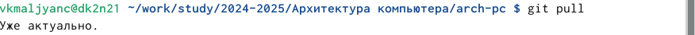{#fig:002 width=70%}

Перехожу в каталог с шаблоном отчета по лабораторной работе № 3 (рис. [-@fig:003]).

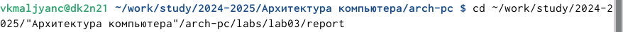{#fig:003 width=70%}

Провожу компиляцию шаблона с использованием Makefile. Для этого ввожу команду make (рис. [-@fig:004]).

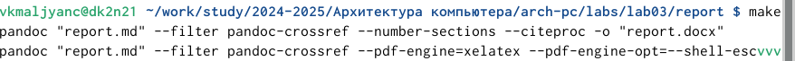{#fig:004 width=70%}

Открываю сгенерированный файл report.doch в LibreOffice (рис. [-@fig:005]).

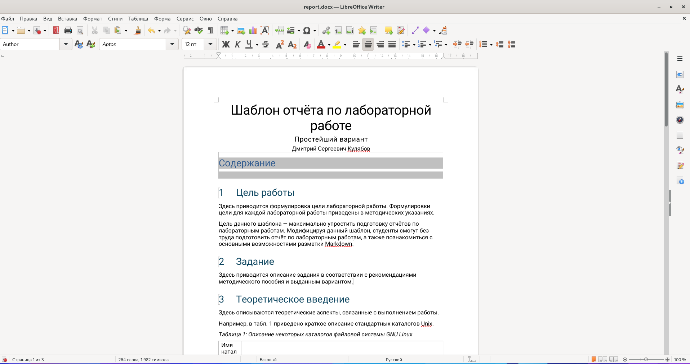{#fig:005 width=70%}

Открываю сгенерированный файл report.pdf (рис. [-@fig:006]). Убеждаюсь в корректности полученных файлов.

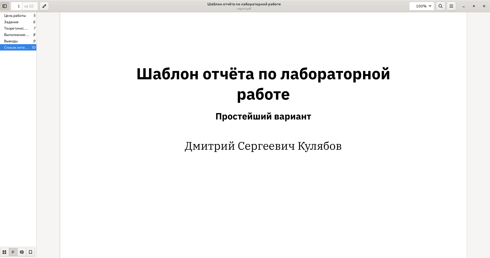{#fig:006 width=70%}

Удаляю полученные файлы с использованием команды Makefile. Для этого ввожу команду make clean (рис. [-@fig:007]).

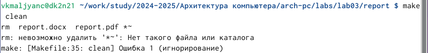{#fig:007 width=70%}

Убеждаюсь в том, что файлы report.doch и report.pdf были удалены (рис. [-@fig:008]).

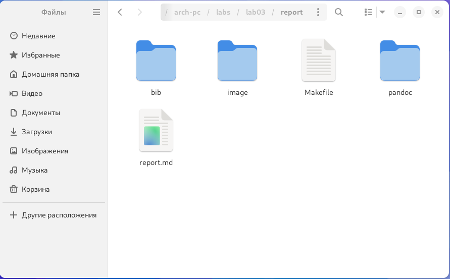{#fig:008 width=70%}

Открываю файл report.md с помощью текстового редактора gedit (рис. [-@fig:009]).

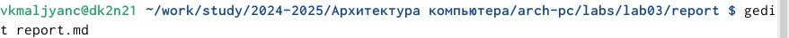{#fig:009 width=70%}

Заполняю отчет (рис. [-@fig:010]).

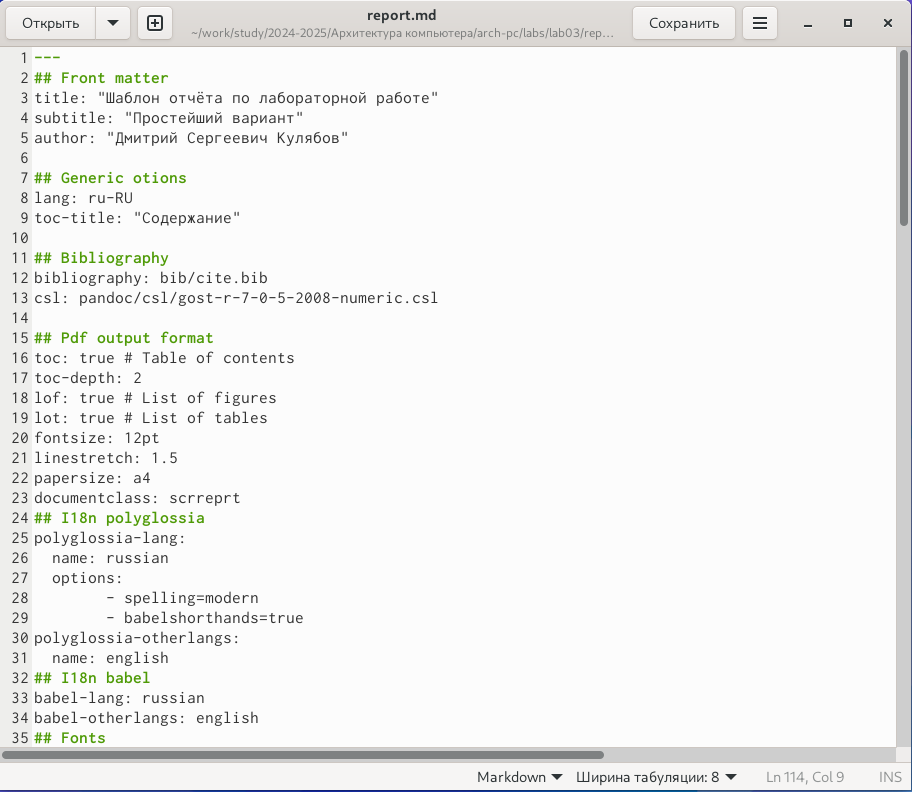{#fig:010 width=70%}

Компилирую файл с отчетом. Загружаю отчет на Github.

## Задание для самостоятельной работы
Заполняю отчет по лабораторной работе № 2 (рис. [-@fig:011])

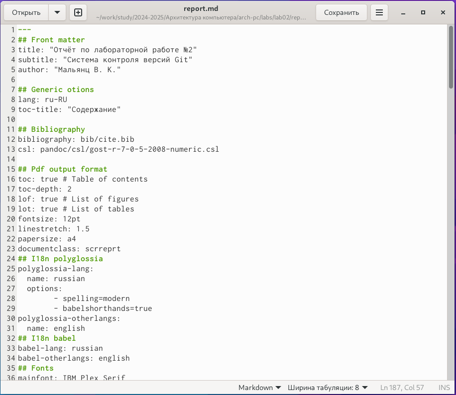{#fig:011 width=70%}

Провожу компиляцию файла с использованием Makefile. Для этого ввожу ко-
манду make (рис. [-@fig:012]).

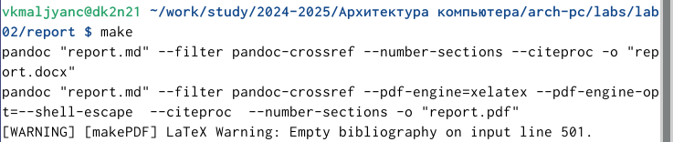{#fig:012 width=70%}

Открываю сгенерированный файл report.doch в LibreOffice (рис. [-@fig:013]) 

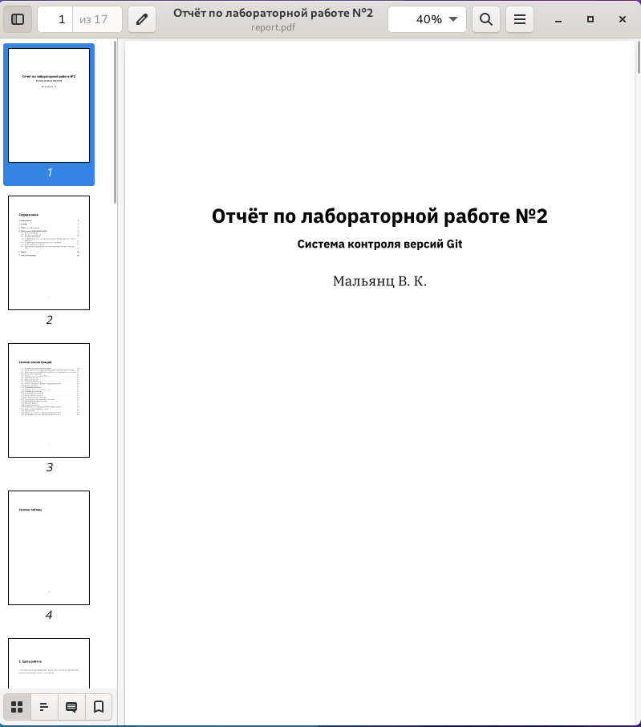{#fig:013 width=70%}

Открываю сгенерированный файл report.pdf (рис. [-@fig:014]). Убеждаюсь в корректности полученных файлов.

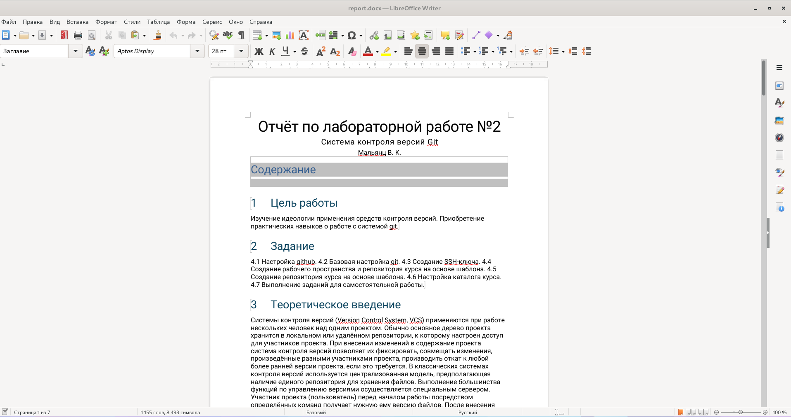{#fig:014 width=70%}

Перехожу в каталог arch-pc (рис. [-@fig:015]).

{#fig:015 width=70%}

Добавляю изменения на Github с помощью команды git add . (рис. [-@fig:016]).

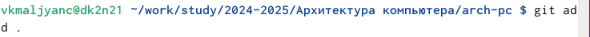{#fig:016 width=70%}

Сохраняю изменения на Github с помощью команды git commit -am (рис. [-@fig:017]).

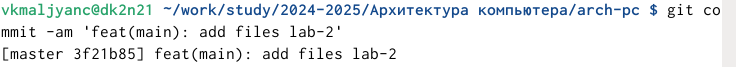{#fig:017 width=70%}

Отправляю все произведенные изменения локального дерева в центральный репозиторий (рис. [-@fig:018]).

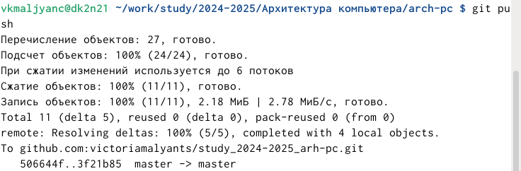{#fig:018 width=70%}

# Выводы

Я освоила процедуры оформления отчетов с помощью легковесного языка разметки Markdown.
