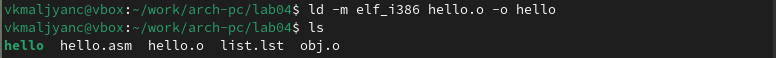

---
## Front matter
title: "Отчёт по лабораторной работе № 4"
subtitle: "Создание и процесс обработки программ на языке ассемблера NASM"
author: "Мальянц Виктория Кареновна"

## Generic otions
lang: ru-RU
toc-title: "Содержание"

## Bibliography
bibliography: bib/cite.bib
csl: pandoc/csl/gost-r-7-0-5-2008-numeric.csl

## Pdf output format
toc: true # Table of contents
toc-depth: 2
lof: true # List of figures
lot: true # List of tables
fontsize: 12pt
linestretch: 1.5
papersize: a4
documentclass: scrreprt
## I18n polyglossia
polyglossia-lang:
  name: russian
  options:
	- spelling=modern
	- babelshorthands=true
polyglossia-otherlangs:
  name: english
## I18n babel
babel-lang: russian
babel-otherlangs: english
## Fonts
mainfont: IBM Plex Serif
romanfont: IBM Plex Serif
sansfont: IBM Plex Sans
monofont: IBM Plex Mono
mathfont: STIX Two Math
mainfontoptions: Ligatures=Common,Ligatures=TeX,Scale=0.94
romanfontoptions: Ligatures=Common,Ligatures=TeX,Scale=0.94
sansfontoptions: Ligatures=Common,Ligatures=TeX,Scale=MatchLowercase,Scale=0.94
monofontoptions: Scale=MatchLowercase,Scale=0.94,FakeStretch=0.9
mathfontoptions:
## Biblatex
biblatex: true
biblio-style: "gost-numeric"
biblatexoptions:
  - parentracker=true
  - backend=biber
  - hyperref=auto
  - language=auto
  - autolang=other
  - citestyle=gost-numeric
## Pandoc-crossref LaTeX customization
figureTitle: "Рис."
tableTitle: "Таблица"
listingTitle: "Листинг"
lofTitle: "Список иллюстраций"
lotTitle: "Список таблиц"
lolTitle: "Листинги"
## Misc options
indent: true
header-includes:
  - \usepackage{indentfirst}
  - \usepackage{float} # keep figures where there are in the text
  - \floatplacement{figure}{H} # keep figures where there are in the text
---

# Цель работы

Освоение процедуры компиляции и сборки программ, написанных на ассемблере NASM.

# Задание

1. Создание программы Hello world!
2. Работа с транслятором NASM
3. Работа с расширенным синтаксисом командной строки NASM
4. Работа с компоновщиком LD
5. Запуск исполняемого файла
6. Выполнение заданий для самостоятельной работы

# Выполнение лабораторной работы
## Создание программы Hello world!
 Создаю каталог для работы с программами на языке ассемблера Nasm с помощью команды mkdir -p (рис. [-@fig:001]).

{#fig:001 width=70%}

Перехожу в созданный каталог с помощью команды cd (рис. [-@fig:002]).

{#fig:002 width=70%}

Создаю текстовый файл с именем hello.asm с помощью команды touch (рис. [-@fig:003]).

{#fig:003 width=70%}

Открываю этот файл с помощью текстового редактора gedit (рис. [-@fig:004])  (рис. [-@fig:005]).

{#fig:004 width=70%}

{#fig:005 width=70%}

 Заполняю файл, вставляя в него программу для вывода  "Hello World!" (рис. [-@fig:006]).

{#fig:006 width=70%}

##  Работа с транслятором NASM
 Преобразовываю текст программы "Hello World!" в объектный код с помощью транслятора NASM. Для этого использую команду nasm -f elf hello.asm, ключ -f указывает транслятору, что требуется создать бинарные файлы в формате ELF. Проверяю, что объектный файл был создан с помощью команды ls. Объектный файл имеет имя hello.o (рис. [-@fig:007]). 

{#fig:007 width=70%}

##  Работа с расширенным синтаксисом командной строки NASM
Ввожу команду, которая скомпилирует исходный файл hello.asm в obj.o, при этом формат выходного файла будет elf, и в него будут включены символы для отладки (опция -g) и будет создан файл листинга list.lst (опция -l). С помощью команды ls проверяю, что файлы были созданы  (рис. [-@fig:008]).

{#fig:008 width=70%}

## Работа с компоновщиком LD
Передаю объектный файл на обработку компоновщику LD, чтобы получить программу hello. Ввожу команду ld -m elf_i386 obj.o -o main. Ключ -o задает имя создаваемого исполняемого файла. С помощью команды ls проверяю, что файл hello был создан  (рис. [-@fig:009]).

{#fig:009 width=70%}

Выполняю следующую программу  (рис. [-@fig:010]). Исполняемый файл будет иметь имя main. Объектный файл, из которого собран исполняемый файл, имеет имя obj.o.

{#fig:010 width=70%}

## Запуск исполняемого файла
Запускаю на выполнение созданный исполняемый файл hello (рис. [-@fig:011]).

{#fig:011 width=70%}

## Выполнение заданий для самостоятельной работы
С помощью команды cp создаю копию файла hello.asm с именем lab4.asm в каталоге ~/work/arch-pc/lab04  (рис. [-@fig:012]).

{#fig:012 width=70%}

С помощью текстового редактора gedit открываю файл lab4.asm. В нем вношу изменения в программу так, чтобы вместо Hello world! на экран выводилась строка с моими именем и фамилией (рис. [-@fig:013]) (рис. [-@fig:014]).

{#fig:013 width=70%}

{#fig:014 width=70%}

Компилирую текст программы в объектный файл. Проверяю с помощью команды ls, что файл lab4.o создан (рис. [-@fig:015]).

{#fig:015 width=70%}

Передаю объектный файл lab4.0 на обработку компоновщику LD, чтобы получить исполняемый файл lab4.  С помощью команды ls проверяю, что файл lab4 был создан  (рис. [-@fig:016]). 

{#fig:016 width=70%}

Запускаю исполняемый файл lab4  (рис. [-@fig:017]). 

{#fig:017 width=70%}

Копирую файл hello.asm в каталог ~/work/study/2024-2025/"Архитектура компьютера"/arch-pc/labs/lab04/ (рис. [-@fig:018]). 

{#fig:018 width=70%}

Копирую файл lab4.asm в каталог ~/work/study/2024-2025/"Архитектура компьютера"/arch-pc/labs/lab04/ (рис. [-@fig:019]). 

{#fig:019 width=70%}

Перехожу в каталог ~/work/study/2024-2025/"Архитектура компьютера"/arch-pc/labs/lab04/ (рис. [-@fig:020]). 

{#fig:020 width=70%}

С помощью команды ls убеждаюсь в том, что файлы hello.asm и lab4.asm скопированы в каталог (рис. [-@fig:021]). 

{#fig:021 width=70%}

Добавляю изменения на Github с помощью команды git add . (рис. [-@fig:022]). 

{#fig:022 width=70%}

Сохраняю изменения на Github с помощью команды git commit -m (рис. [-@fig:023]). 

{#fig:023 width=70%}

Отправляю все произведенные изменения локального дерева в центральный репозиторий (рис. [-@fig:024]). 

{#fig:024 width=70%}

# Выводы

Я освоила процедуры компиляции и сборки программ, написанных на ассемблере NASM.

