---
## Front matter
title: "Отчет по лабораторной работе №5"
subtitle: "Основы работы с Midnight Commander (mc). Структура программы на языке ассемблера NASM. Системные вызовы в ОС GNU Linux"
author: "Мальянц Виктория Кареновна"

## Generic otions
lang: ru-RU
toc-title: "Содержание"

## Bibliography
bibliography: bib/cite.bib
csl: pandoc/csl/gost-r-7-0-5-2008-numeric.csl

## Pdf output format
toc: true # Table of contents
toc-depth: 2
lof: true # List of figures
lot: true # List of tables
fontsize: 12pt
linestretch: 1.5
papersize: a4
documentclass: scrreprt
## I18n polyglossia
polyglossia-lang:
  name: russian
  options:
	- spelling=modern
	- babelshorthands=true
polyglossia-otherlangs:
  name: english
## I18n babel
babel-lang: russian
babel-otherlangs: english
## Fonts
mainfont: IBM Plex Serif
romanfont: IBM Plex Serif
sansfont: IBM Plex Sans
monofont: IBM Plex Mono
mathfont: STIX Two Math
mainfontoptions: Ligatures=Common,Ligatures=TeX,Scale=0.94
romanfontoptions: Ligatures=Common,Ligatures=TeX,Scale=0.94
sansfontoptions: Ligatures=Common,Ligatures=TeX,Scale=MatchLowercase,Scale=0.94
monofontoptions: Scale=MatchLowercase,Scale=0.94,FakeStretch=0.9
mathfontoptions:
## Biblatex
biblatex: true
biblio-style: "gost-numeric"
biblatexoptions:
  - parentracker=true
  - backend=biber
  - hyperref=auto
  - language=auto
  - autolang=other
  - citestyle=gost-numeric
## Pandoc-crossref LaTeX customization
figureTitle: "Рис."
tableTitle: "Таблица"
listingTitle: "Листинг"
lofTitle: "Список иллюстраций"
lotTitle: "Список таблиц"
lolTitle: "Листинги"
## Misc options
indent: true
header-includes:
  - \usepackage{indentfirst}
  - \usepackage{float} # keep figures where there are in the text
  - \floatplacement{figure}{H} # keep figures where there are in the text
---

# Цель работы

Приобретение практических навыков работы в Midnight Commander. Освоение инструкций
языка ассемблера mov и int.

# Выполнение лабораторной работы

Открываю Midnight Commander с помощью команды mc (рис. [-@fig:001]).

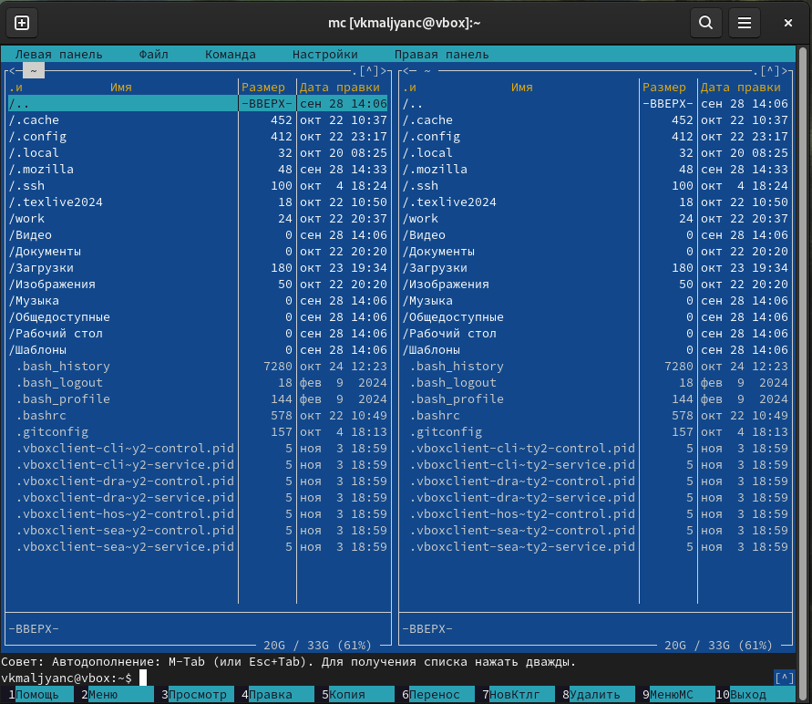{#fig:001 width=70%}

Перехожу в каталог ~/work/arch-pc с помощью файлового менеджера mc  (рис. [-@fig:002]).

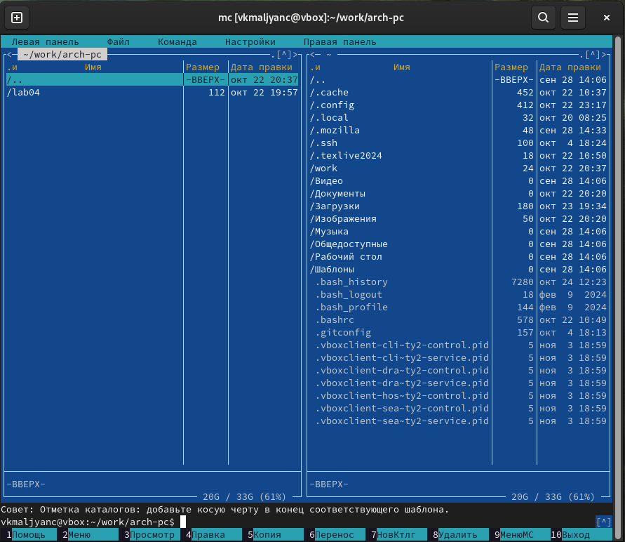{#fig:002 width=70%}

Создаю папку lab05 с помощью функциональной клавиши F7 (рис. [-@fig:003]) и перехожу в нее (рис. [-@fig:004]).

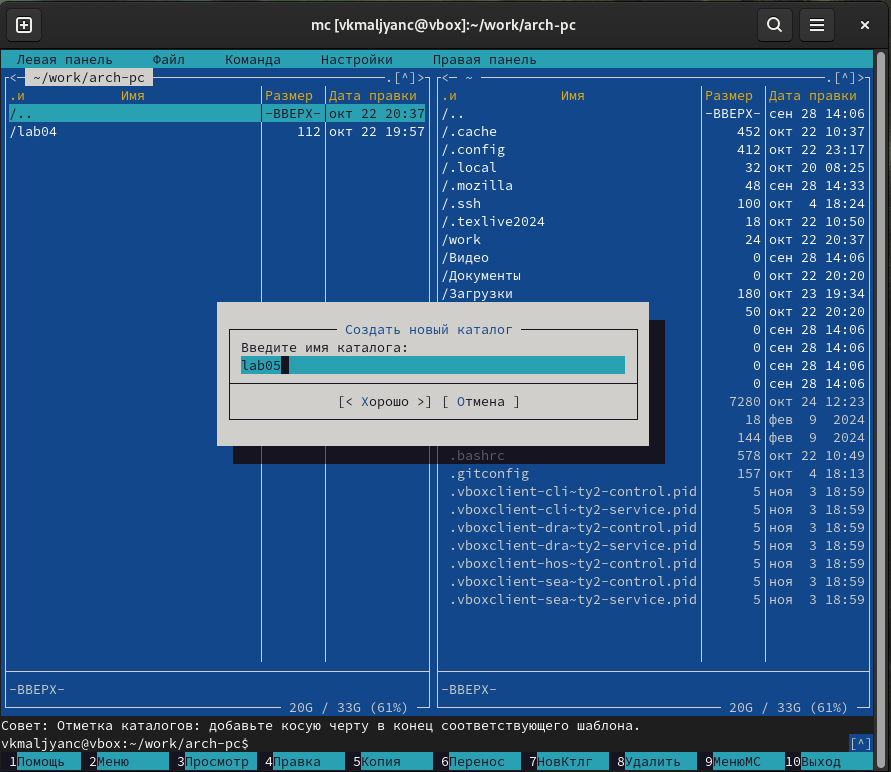{#fig:003 width=70%}

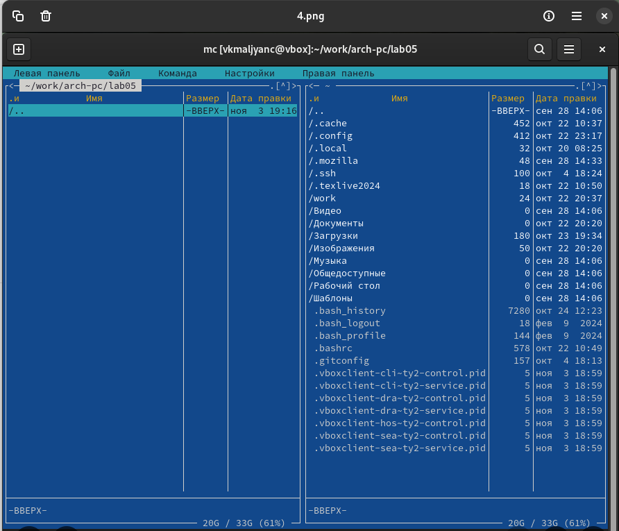{#fig:004 width=70%}

В строке ввода с помощью команды touch создаю файл lab-1.asm (рис. [-@fig:005]).

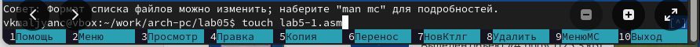{#fig:005 width=70%}

Открываю файл lab5-1.asm для редактирования во встроенном редакторе с помощью функциональной клавиши F4 (рис. [-@fig:006]).

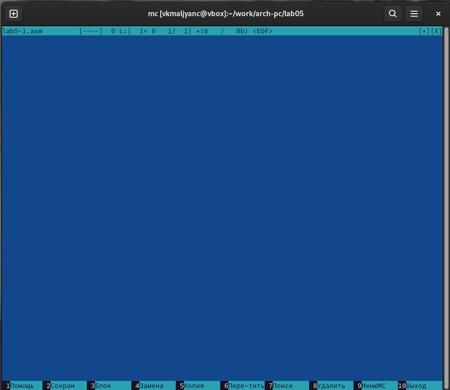{#fig:006 width=70%}

Ввожу текст программы вывода сообщения на экран и ввода строки с клавиатуры (рис. [-@fig:007]).

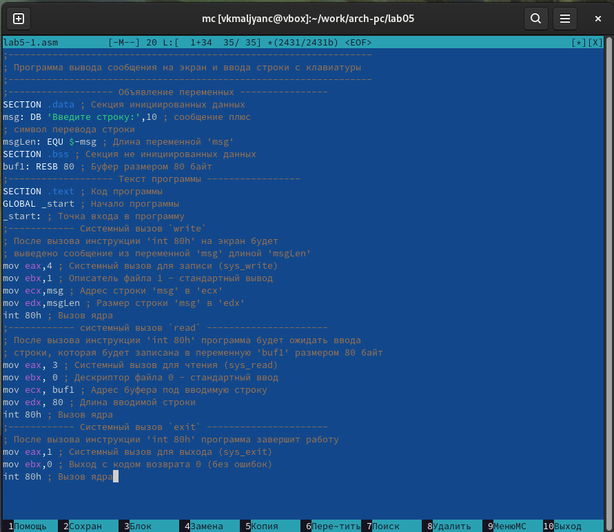{#fig:007 width=70%}

Сохраняю изменения с помощью функциональной клавиши F2 (рис. [-@fig:008]).

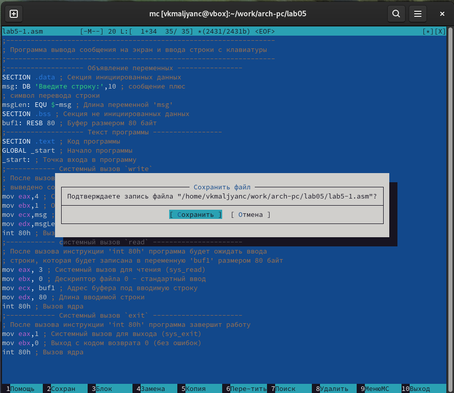{#fig:008 width=70%}

Выхожу из редактора с помощью функциональной клавиши F10 (рис. [-@fig:009]).

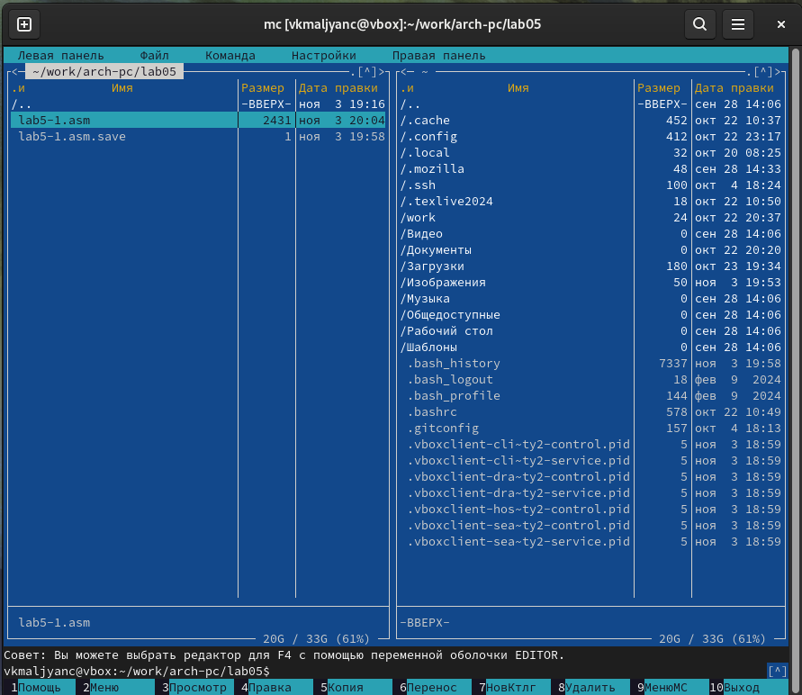{#fig:009 width=70%}

Открываю файл lab5-1.asm для просмотра с помощью функциональной клавиши F3. Убеждаюсь, что файл содержит текст программы (рис. [-@fig:010]).

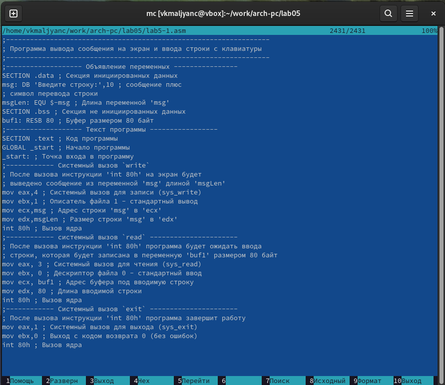{#fig:010 width=70%}

Транслирую текст программы lab5-1.asm в объектный файл (рис. [-@fig:011]).

{#fig:011 width=70%}

Передаю объектный файл на обработку компоновщику LD (рис. [-@fig:012]).

{#fig:012 width=70%}

Запускаю получившийся исполняемый файл (рис. [-@fig:013]).

{#fig:013 width=70%}

Скачиваю файл in_out_asm со страницы курса в ТУИС, он сохранился в каталог Загрузки (рис. [-@fig:014]).

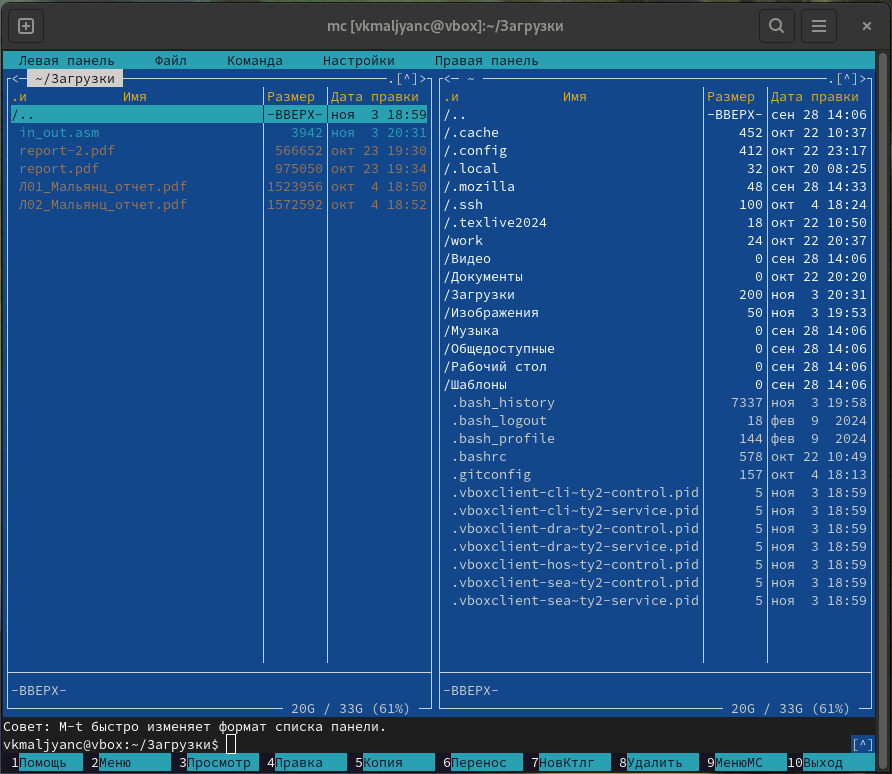{#fig:014 width=70%}

Копирую файл in_out.asm из каталога Загрузки в каталог lab05 с помощью функциональной клавиши F5 (рис. [-@fig:015]).

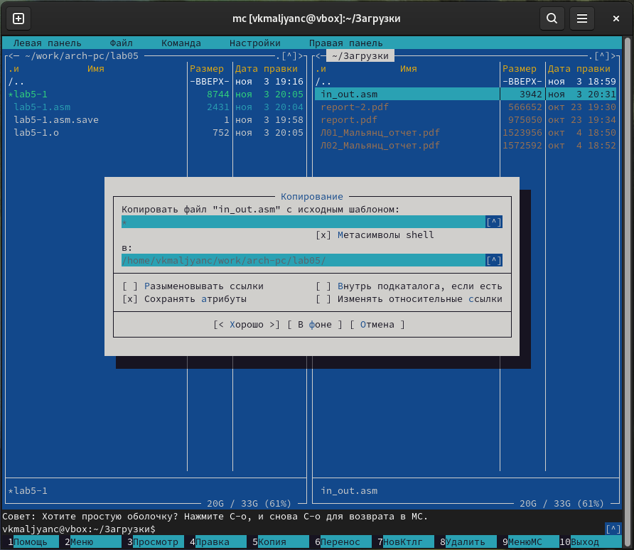{#fig:015 width=70%}

Создаю копию файла lab5-1.asm с именем lab5-2.asm с помощью функциональной клавиши F6 (рис. [-@fig:016]).

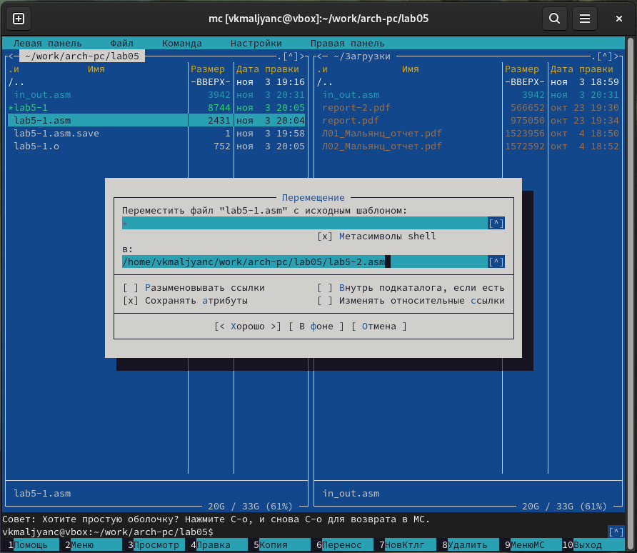{#fig:016 width=70%}

Исправляю текст программы в файле lab5-2.asm с использованием подпрограмм из внешнего файла in_out.asm (использую подпрограммы sprintLF, sread и quit) (рис. [-@fig:017]).

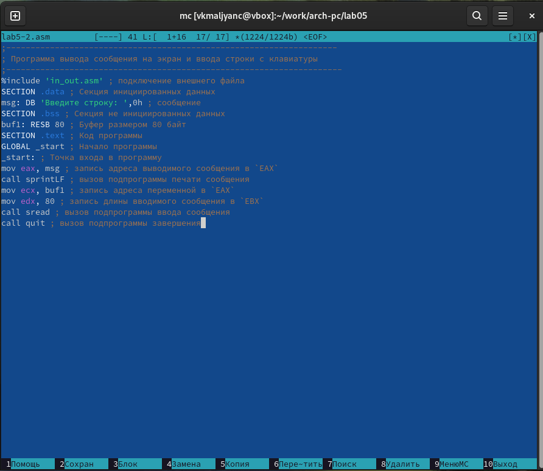{#fig:017 width=70%}

Транслирую текст программы lab5-2.asm в объектный файл, передаю объектный файл на обработку компоновщику LD, запускаю получившийся исполняемый файл (рис. [-@fig:018]).

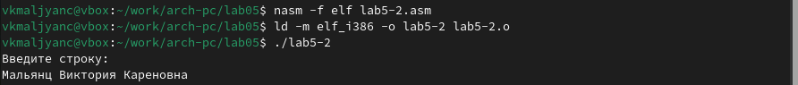{#fig:018 width=70%}

Заменяю подпрограмму sprintLF на sprint в файле lab5-2.asm (рис. [-@fig:019]).

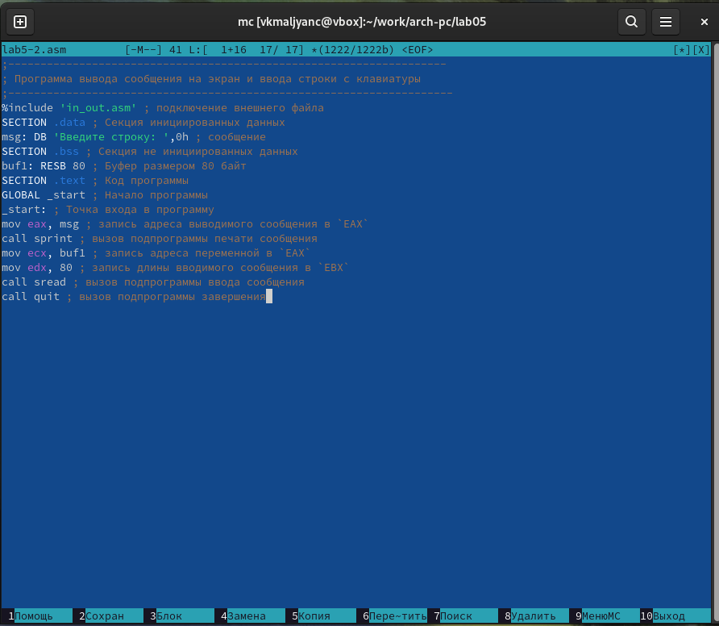{#fig:019 width=70%}

Транслирую текст программы lab5-2.asm в объектный файл, передаю объектный файл на обработку компоновщику LD, запускаю получившийся исполняемый файл (рис. [-@fig:020]).

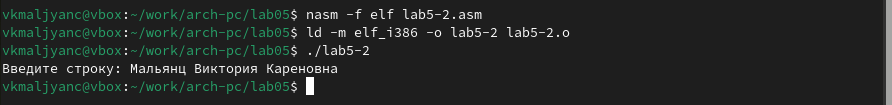{#fig:020 width=70%}

Разница между первым (с подпрограммой sprintLF) и вторым (с подпрограммой sprint) исполняемыми файлами зааключается в том, что в первом исполняемом файле запуск запрашивает ввод с новой строки, а во втором исполняемом файле запуск запрашивает ввод без переноса на новую строку. 

## Выполнение заданий для самостоятельной работы

1. Создаю копию файла lab5-1.asm с именем lab5-1-1.asm с помощью функциональной клавиши F5 (рис. [-@fig:021]).

{#fig:021 width=70%}

Открываю файл lab5-1-1.asm для редактирования во встроенном редакторе с помощью функциональной клавиши F4. Ввожу текст программы вывода сообщения на экран, ввода строки с клавиатуры и вывода введенной строки на экран (рис. [-@fig:022]). Сохраняю изменения с помощью функциональной клавиши F2. Выхожу из редактора с помощью функциональной клавиши F10.

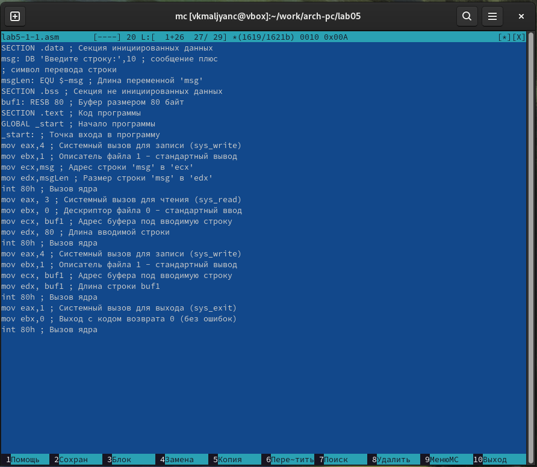{#fig:022 width=70%}

Листинг программы:

```
SECTION .data ; Секция инициированных данных
msg: DB 'Введите строку:',10 ; сообщение плюс
; символ перевода строки
msgLen: EQU $-msg ; Длина переменной 'msg'
SECTION .bss ; Секция не инициированных данных
buf1: RESB 80 ; Буфер размером 80 байт
SECTION .text ; Код программы
GLOBAL _start ; Начало программы
_start: ; Точка входа в программу
mov eax,4 ; Системный вызов для записи (sys_write)
mov ebx,1 ; Описатель файла 1 - стандартный вывод
mov ecx,msg ; Адрес строки 'msg' в 'ecx'
mov edx,msgLen ; Размер строки 'msg' в 'edx'
int 80h ; Вызов ядра
mov eax, 3 ; Системный вызов для чтения (sys_read)
mov ebx, 0 ; Дескриптор файла 0 - стандартный ввод
mov ecx, buf1 ; Адрес буфера под вводимую строку
mov edx, 80 ; Длина вводимой строки
int 80h ; Вызов ядра
mov eax,4 ; Системный вызов для записи (sys_write)
mov ebx,1 ; Описатель файла 1 - стандартный вывод
mov ecx, buf1 ; Адрес буфера под вводимую строку
mov edx, buf1 ; Длина строки buf1
int 80h ; Вызов ядра
mov eax,1 ; Системный вызов для выхода (sys_exit)
mov ebx,0 ; Выход с кодом возврата 0 (без ошибок)
int 80h ; Вызов ядра
```
2. Транслирую текст программы lab5-1-1.asm в объектный файл, передаю объектный файл на обработку компоновщику LD, запускаю получившийся исполняемый файл. Ввожу свои ФИО. Программа выводит введенные мною данные (рис. [-@fig:023]). 

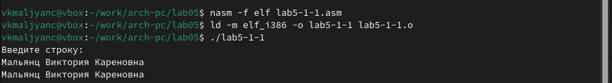{#fig:023 width=70%}

3. Создаю копию файла lab5-2.asm с именем lab5-2-1.asm с помощью функциональной клавиши F5 (рис. [-@fig:024]).

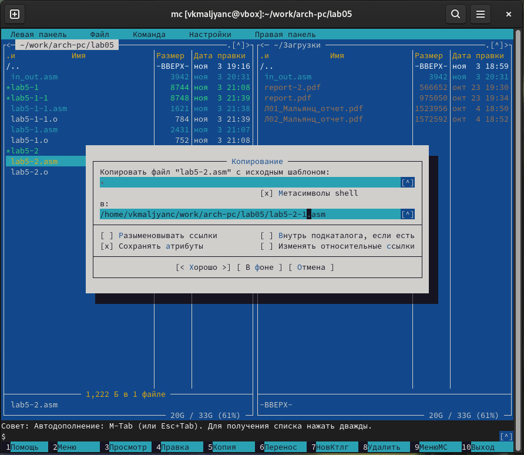{#fig:024 width=70%}

Открываю файл lab5-2-1.asm для редактирования во встроенном редакторе с помощью функциональной клавиши F4. Ввожу текст программы вывода сообщения на экран, ввода строки с клавиатуры и вывода введенной строки на экран (рис. [-@fig:025]). Сохраняю изменения с помощью функциональной клавиши F2. Выхожу из редактора с помощью функциональной клавиши F10.

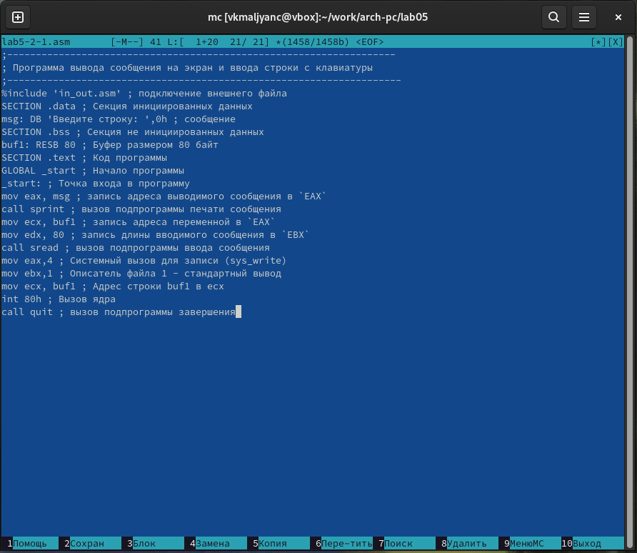{#fig:025 width=70%}

Листинг программы: 

```
;--------------------------------------------------------------------
; Программа вывода сообщения на экран и ввода строки с клавиатуры
;---------------------------------------------------------------------
%include 'in_out.asm' ; подключение внешнего файла
SECTION .data ; Секция инициированных данных
msg: DB 'Введите строку: ',0h ; сообщение
SECTION .bss ; Секция не инициированных данных
buf1: RESB 80 ; Буфер размером 80 байт
SECTION .text ; Код программы
GLOBAL _start ; Начало программы
_start: ; Точка входа в программу
mov eax, msg ; запись адреса выводимого сообщения в `EAX`
call sprint ; вызов подпрограммы печати сообщения
mov ecx, buf1 ; запись адреса переменной в `EAX`
mov edx, 80 ; запись длины вводимого сообщения в `EBX`
call sread ; вызов подпрограммы ввода сообщения
mov eax,4 ; Системный вызов для записи (sys_write)
mov ebx,1 ; Описатель файла 1 - стандартный вывод
mov ecx, buf1 ; Адрес строки buf1 в ecx
int 80h ; Вызов ядра
call quit ; вызов подпрограммы завершения
```

4. Транслирую текст программы lab5-2-1.asm в объектный файл, передаю объектный файл на обработку компоновщику LD, запускаю получившийся исполняемый файл. Ввожу свои ФИО. Программа выводит введенные мною данные (рис. [-@fig:026]).

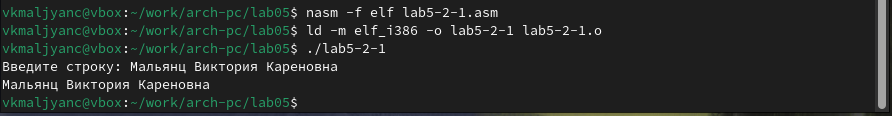{#fig:026 width=70%}

# Выводы

Я приобрела практические навыки работы в Midnight Commander. Освоила инструкции
языка ассемблера mov и int.


