---
## Front matter
title: "Отчет по лабораторной работе №6"
subtitle: "Арифметические операции в NASM"
author: "Мальянц Виктория Кареновна"

## Generic otions
lang: ru-RU
toc-title: "Содержание"

## Bibliography
bibliography: bib/cite.bib
csl: pandoc/csl/gost-r-7-0-5-2008-numeric.csl

## Pdf output format
toc: true # Table of contents
toc-depth: 2
lof: true # List of figures
lot: true # List of tables
fontsize: 12pt
linestretch: 1.5
papersize: a4
documentclass: scrreprt
## I18n polyglossia
polyglossia-lang:
  name: russian
  options:
	- spelling=modern
	- babelshorthands=true
polyglossia-otherlangs:
  name: english
## I18n babel
babel-lang: russian
babel-otherlangs: english
## Fonts
mainfont: IBM Plex Serif
romanfont: IBM Plex Serif
sansfont: IBM Plex Sans
monofont: IBM Plex Mono
mathfont: STIX Two Math
mainfontoptions: Ligatures=Common,Ligatures=TeX,Scale=0.94
romanfontoptions: Ligatures=Common,Ligatures=TeX,Scale=0.94
sansfontoptions: Ligatures=Common,Ligatures=TeX,Scale=MatchLowercase,Scale=0.94
monofontoptions: Scale=MatchLowercase,Scale=0.94,FakeStretch=0.9
mathfontoptions:
## Biblatex
biblatex: true
biblio-style: "gost-numeric"
biblatexoptions:
  - parentracker=true
  - backend=biber
  - hyperref=auto
  - language=auto
  - autolang=other
  - citestyle=gost-numeric
## Pandoc-crossref LaTeX customization
figureTitle: "Рис."
tableTitle: "Таблица"
listingTitle: "Листинг"
lofTitle: "Список иллюстраций"
lotTitle: "Список таблиц"
lolTitle: "Листинги"
## Misc options
indent: true
header-includes:
  - \usepackage{indentfirst}
  - \usepackage{float} # keep figures where there are in the text
  - \floatplacement{figure}{H} # keep figures where there are in the text
---

# Цель работы

Освоение арифметических инструкций языка ассемблера NASM.

# Задание

1. Символьные и численные данные в NASM
2. Выполнение арифметических операций в NASM
3. Выполнение заданий для самостоятельной работы

# Выполнение лабораторной работы
## Символьные и численные данные в NASM

С помощью команды mkdir создаю каталог lab06 (рис. [-@fig:001]).

{#fig:001 width=70%}

С помощью команды cd перехожу в каталог lab06 (рис. [-@fig:002]).

{#fig:002 width=70%}

С помощью команды touch создаю файл lab6-1.asm (рис. [-@fig:003]).

{#fig:003 width=70%}

С помощью команды cp копирую файл in_out.asm (рис. [-@fig:004]).

{#fig:004 width=70%}

С помощью команды ls просматриваю содержимое каталога lab06 (рис. [-@fig:005]).

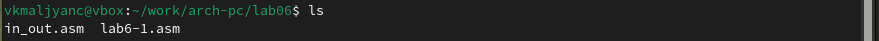{#fig:005 width=70%}

Открываю файл lab6-1.asm в текстовом редакторе gedit через терминал (рис. [-@fig:006]).

{#fig:006 width=70%}

Ввожу в файл lab6-1.asm программу вывода значения регистра eax (рис. [-@fig:007]).

{#fig:007 width=70%}

Создаю исполняемый файл и запускаю его. Вывод программы: символ j, потому что программа вывела символ, соответсвующий по системе ASCII сумме двоичных кодов символов 6 и 4 (рис. [-@fig:008]).

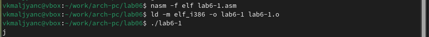{#fig:008 width=70%}

Открываю файл lab6-1.asm в текстовом редакторе gedit через терминал (рис. [-@fig:009]).

{#fig:009 width=70%}

Изменяю в тексте программы символы "6" и "4" на 6 и 4 (рис. [-@fig:010]).

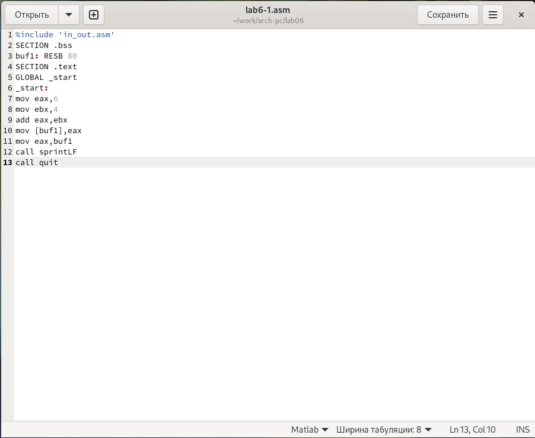{#fig:010 width=70%}

Создаю исполняемый файл и запускаю его. Вывод программы: символ с кодом 10, это символ перевода строки, не отображается при выводе на экран (рис. [-@fig:011]).

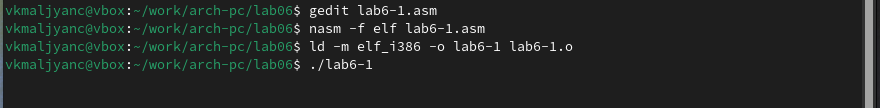{#fig:011 width=70%}

С помощью команды touch создаю файл lab6-2.asm (рис. [-@fig:012]).

{#fig:012 width=70%}

Открываю файл lab6-2.asm в текстовом редакторе gedit через терминал (рис. [-@fig:013]).

{#fig:013 width=70%}

Ввожу в файл lab6-2.asm программу вывода значения регистра eax (рис. [-@fig:014]).

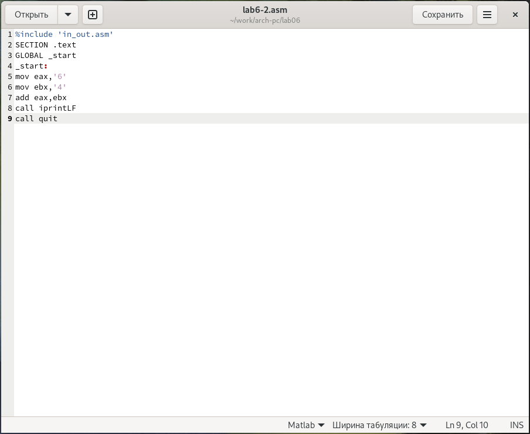{#fig:014 width=70%}

Создаю исполняемый файл и запускаю его. Вывод программы: число 106. Программа складывает символы кодов "6" и  "4" (рис. [-@fig:015]).

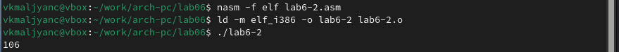{#fig:015 width=70%}

Открываю файл lab6-2.asm в текстовом редакторе gedit через терминал (рис. [-@fig:016]).

{#fig:016 width=70%}

Заменяю в тексте программы "6" и "4" на 6 и 4 (рис. [-@fig:017]).

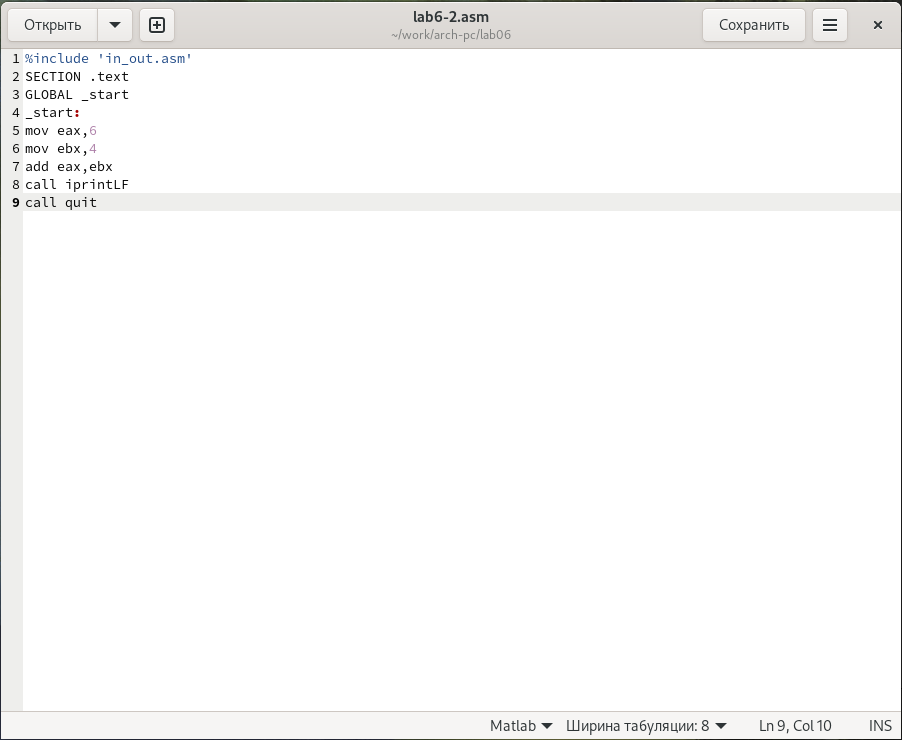{#fig:017 width=70%}

Создаю исполняемый файл и запускаю его. Вывод программы: 10. Программа складывает числа 6 и 4 (рис. [-@fig:018]).

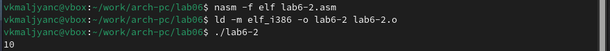{#fig:018 width=70%}

Открываю файл lab6-2.asm в текстовом редакторе gedit через терминал (рис. [-@fig:019]).

{#fig:019 width=70%}

Заменяю в тексте программы функцию iprintLF на iprint (рис. [-@fig:020]).

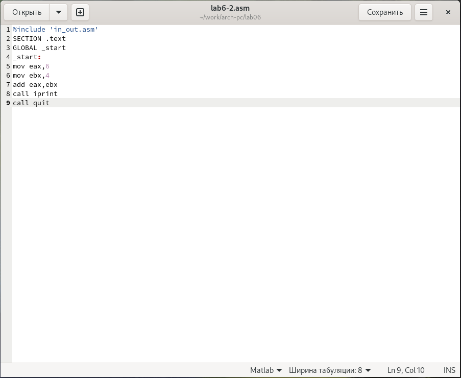{#fig:020 width=70%}

Создаю исполняемый файл и запускаю его. Вывод не изменился. Отличие между iprintLF и iprint заключается в том, что iprintLF добавляет к выводу символ переноса строки, а iprint - не добавляет (рис. [-@fig:021]).

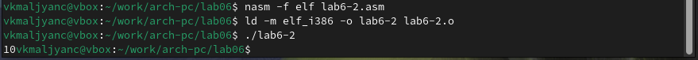{#fig:021 width=70%}

## Выполнение арифметических операций в NASM

С помощью команды touch создаю файл lab6-3.asm (рис. [-@fig:022]).

{#fig:022 width=70%}

Открываю файл lab6-3.asm в текстовом редакторе gedit через терминал (рис. [-@fig:023]).

{#fig:023 width=70%}

Ввожу в файл lab6-3.asm программу вычисления выражения $$𝑓(𝑥) = (5 ∗ 2 + 3)/3$$ (рис. [-@fig:024]).

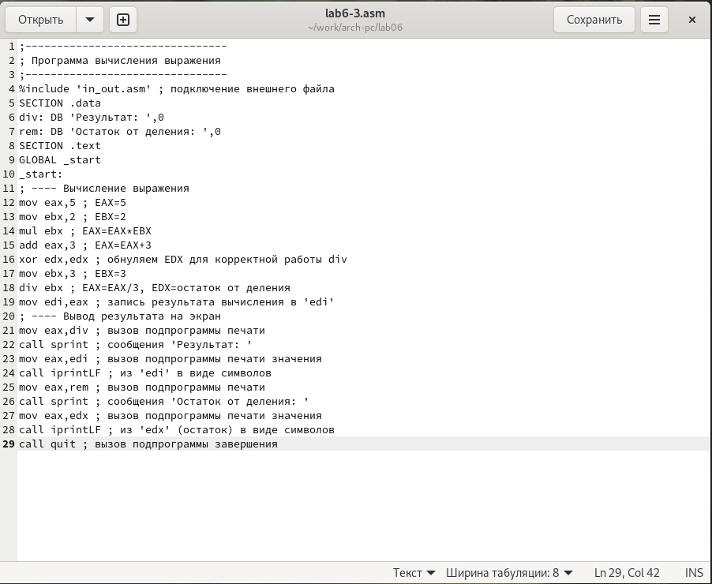{#fig:024 width=70%}

Создаю исполняемый файл и запускаю его (рис. [-@fig:025]).

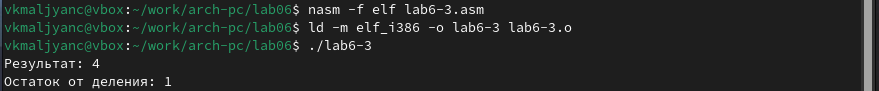{#fig:025 width=70%}

Открываю файл lab6-3.asm в текстовом редакторе gedit через терминал (рис. [-@fig:026]).

{#fig:026 width=70%}

Изменяю текст программы для вычисления выражения $$𝑓(𝑥) = (4 ∗ 6 + 2)/5$$ (рис. [-@fig:027]).

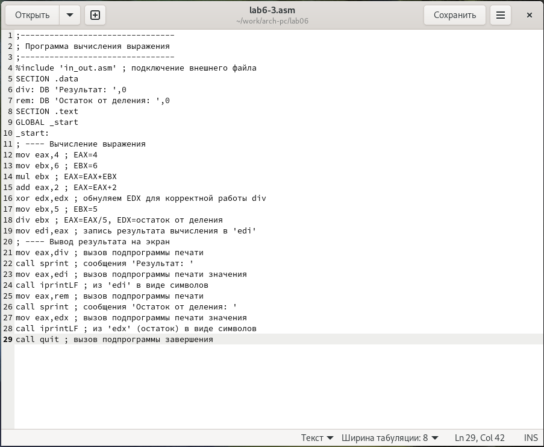{#fig:027 width=70%}

Создаю исполняемый файл и запускаю его (рис. [-@fig:028]).

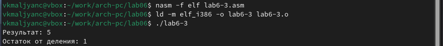{#fig:028 width=70%}

С помощью команды touch создаю файл variant.asm (рис. [-@fig:029]).

{#fig:029 width=70%}

Открываю файл variant.asm в текстовом редакторе gedit через терминал (рис. [-@fig:030]).

{#fig:030 width=70%}

Ввожу программу вычисления варианта задания по номеру студенческого билета (рис. [-@fig:031]).

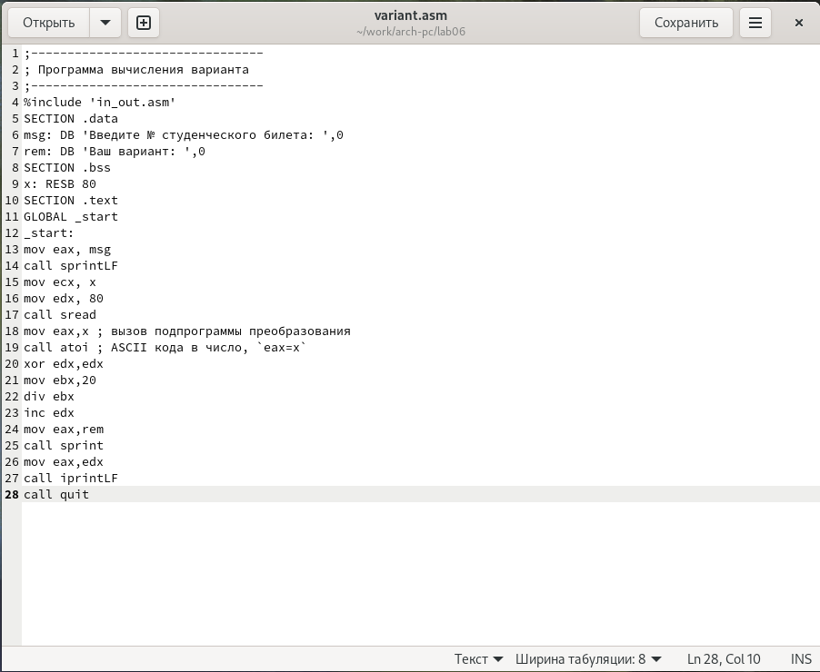{#fig:031 width=70%}

Создаю исполняемый файл и запускаю его (рис. [-@fig:032]).

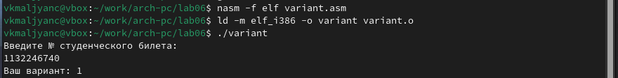{#fig:032 width=70%}

Ответы на вопросы по программе:
1. За вывод на экран сообщения ‘Ваш вариант:’ отвечают строки кода: 

```
mov eax,rem
call sprint
```

2. Инструкция mov ecx, x используется для того, чтобы положить адрес вводимой строки x в регистр ecx. Инструкция mov edx,80 используется для записи в регистр edx длины вводимой строки. Инструкция call sread используется для вызова подпрограммы из внешнего файла, обеспечивающей ввод сообщения с клавиатуры.
3. Инструкция “call atoi” используется для вызова подпрограммы из внешнего файла, которая преобразует ascii-код символа в целое число и записывает результат в регистр EAX
4. В листинге 6.4 за вычисление варианта отвечают строки: 

```
xor edx,edx
mov ebx,20
div ebx
inc edx
```

5. При выполнении инструкции “div ebx” остаток от деления записывается в регистр edx
6. Инструкция “inc edx” увеличивает значение регистра edx на 1
7. В листинге 6.4 за вывод на экран результатов отвечают строки: 

```
mov eax,edx
call iprintLF
```

## Выполнение заданий для самостоятельной работы

С помощью команды touch создаю файл lab6-4.asm (рис. [-@fig:033]).

{#fig:033 width=70%}

Открываю файл lab6-4.asm в текстовом редакторе gedit через терминал (рис. [-@fig:034]).

{#fig:034 width=70%}

Ввожу в файл lab6-4.asm программу вычисления выражения $$𝑓(𝑥) = (10 + 2 * x)/3$$ Это выражение содержится в варианте 1 (рис. [-@fig:035]).

{#fig:035 width=70%}

Создаю исполняемый файл и запускаю его. При вводе значения 1, вывод 4 (рис. [-@fig:036]).

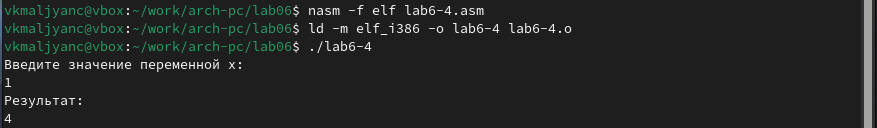{#fig:036 width=70%}

Создаю исполняемый файл и запускаю его. При вводе значения 10, вывод 10 (рис. [-@fig:037]).

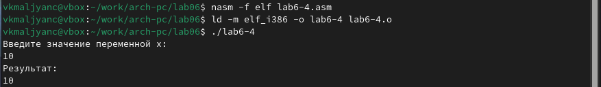{#fig:037 width=70%}

Листинг программы: 

```
%include 'in_out.asm' ; подключение внешнего файла
SECTION .data
msg: DB 'Введите значение переменной x: ',0
rem: DB 'Результат: ',0
SECTION .bss
x: RESB 80
SECTION .text
GLOBAL _start
_start:
; ---- Вычисление выражения
mov eax, msg
call sprintLF
mov ecx, x
mov edx, 80
call sread
mov eax,x   ; вызов подпрограммы преобразования
call atoi   ; ASCII кода в число, `eax=x`
mov ebx,2   ; EBX=2
mul ebx     ; EAX=EAX*EBX
add eax,10  ; EAX=EAX+10
xor edx,edx ; обнуляем EDX для корректной работы div
mov ebx,3   ; EBX=3
div ebx     ; EAX=EAX/3, EDX=остаток от деления
mov edi,eax ; запись результата вычисления в 'edi'
; ---- Вывод результата на экран
mov eax,rem ; вызов подпрограммы печати
call sprintLF ; сообщения 'Результат: '
mov eax,edi ; вызов подпрограммы печати значения
call iprintLF ; из 'edx' (остаток) в виде символов
call quit ; вызов подпрограммы завершения
```

# Выводы

Я освоила арифметические инструкции языка ассемблера NASM.


