---
## Front matter
title: "Отчет по лабораторной работе №7"
subtitle: "Команды безусловного и условного переходов в Nasm. Программирование ветвлений"
author: "Мальянц Виктория Кареновна"

## Generic otions
lang: ru-RU
toc-title: "Содержание"

## Bibliography
bibliography: bib/cite.bib
csl: pandoc/csl/gost-r-7-0-5-2008-numeric.csl

## Pdf output format
toc: true # Table of contents
toc-depth: 2
lof: true # List of figures
lot: true # List of tables
fontsize: 12pt
linestretch: 1.5
papersize: a4
documentclass: scrreprt
## I18n polyglossia
polyglossia-lang:
  name: russian
  options:
	- spelling=modern
	- babelshorthands=true
polyglossia-otherlangs:
  name: english
## I18n babel
babel-lang: russian
babel-otherlangs: english
## Fonts
mainfont: IBM Plex Serif
romanfont: IBM Plex Serif
sansfont: IBM Plex Sans
monofont: IBM Plex Mono
mathfont: STIX Two Math
mainfontoptions: Ligatures=Common,Ligatures=TeX,Scale=0.94
romanfontoptions: Ligatures=Common,Ligatures=TeX,Scale=0.94
sansfontoptions: Ligatures=Common,Ligatures=TeX,Scale=MatchLowercase,Scale=0.94
monofontoptions: Scale=MatchLowercase,Scale=0.94,FakeStretch=0.9
mathfontoptions:
## Biblatex
biblatex: true
biblio-style: "gost-numeric"
biblatexoptions:
  - parentracker=true
  - backend=biber
  - hyperref=auto
  - language=auto
  - autolang=other
  - citestyle=gost-numeric
## Pandoc-crossref LaTeX customization
figureTitle: "Рис."
tableTitle: "Таблица"
listingTitle: "Листинг"
lofTitle: "Список иллюстраций"
lotTitle: "Список таблиц"
lolTitle: "Листинги"
## Misc options
indent: true
header-includes:
  - \usepackage{indentfirst}
  - \usepackage{float} # keep figures where there are in the text
  - \floatplacement{figure}{H} # keep figures where there are in the text
---

# Цель работы

Изучить команды условного и безусловного переходов. Приобрести навыки написания
программ с использованием переходов. Познакомиться с назначением и структурой файла
листинга.

# Задание

1. Реализация переходов в NASM
2. Изучение структуры файлы листинга
3. Выполнение заданий для самостоятельной работы

# Выполнение лабораторной работы

## Реализация переходов в NASM

Создаю каталог для программ лабораторной работы № 7, перехожу в него и создаю файл lab7-1.asm (рис. [-@fig:001]).

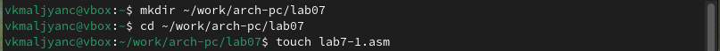{#fig:001 width=70%}

С помощью команды cp копирую файл in_out.asm и просматриваю содержимое каталога lab07 с помощью команды ls (рис. [-@fig:002]).

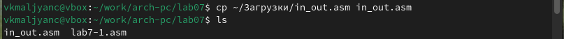{#fig:002 width=70%}

Открываю файл lab7-1.asm в текстовом редакторе gedit через терминал (рис. [-@fig:003]).

{#fig:003 width=70%}

Ввожу в файл lab7-1.asm программу с использованием инструкции jmp (рис. [-@fig:004]).

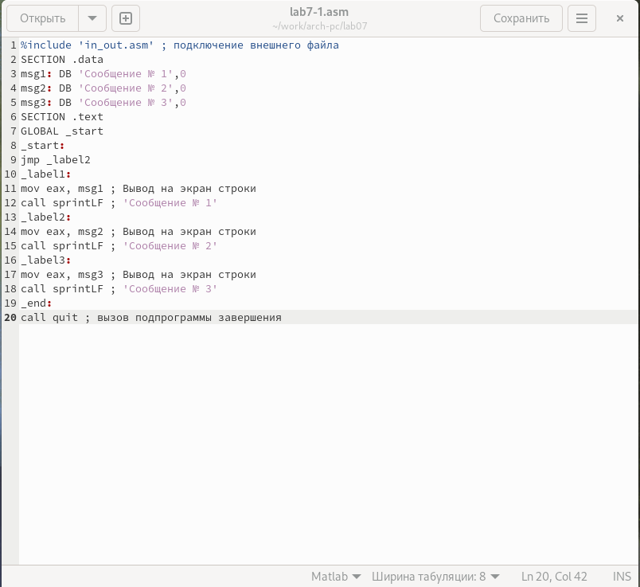{#fig:004 width=70%}

Создаю исполняемый файл и запускаю его. Убеждаюсь в том, что безусловный переход изменяет порядок выволнения инструкций (рис. [-@fig:005]).

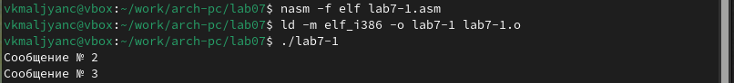{#fig:005 width=70%}

Открываю файл lab7-1.asm в текстовом редакторе gedit через терминал (рис. [-@fig:006]).

{#fig:006 width=70%}

Изменяю программу таким образом, чтобы сначала выводилось "Сообщение № 2", а затем "Сообщение № 3" (рис. [-@fig:007]).

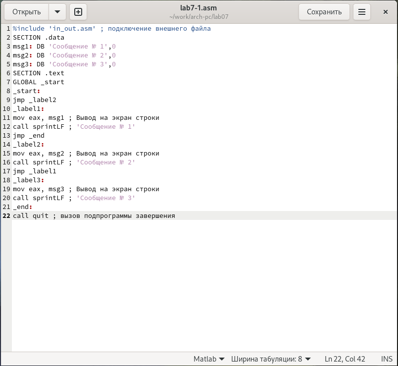{#fig:007 width=70%}

Создаю исполняемый файл и запускаю его. Убеждаюсь в том, что изменения применены корректно (рис. [-@fig:008]).

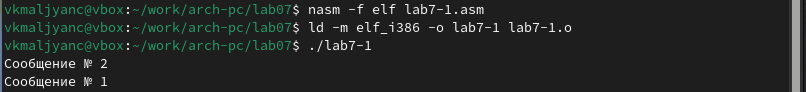{#fig:008 width=70%}

Открываю файл lab7-1.asm в текстовом редакторе gedit через терминал (рис. [-@fig:009]).

{#fig:009 width=70%}

Изменяю программу таким образом, чтобы сначала выводилось "Сообщение № 3", потом "Сообщение № 2", а затем "Сообщение № 1" (рис. [-@fig:010]).

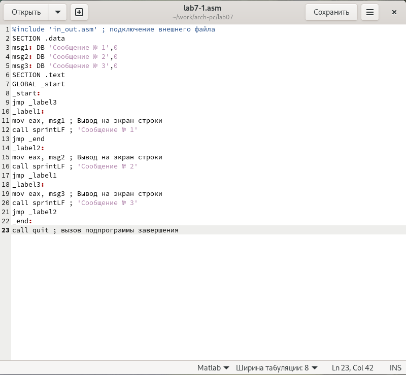{#fig:010 width=70%}

Создаю исполняемый файл и запускаю его. Убеждаюсь в том, что изменения применены корректно (рис. [-@fig:011]).

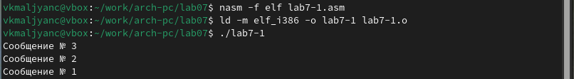{#fig:011 width=70%}

С помощью команды touch создаю файл lab7-2.asm (рис. [-@fig:012]).

{#fig:012 width=70%}

Открываю файл lab7-2.asm в текстовом редакторе gedit через терминал (рис. [-@fig:013]).

{#fig:013 width=70%}

Ввожу в файл lab7-2.asm программу, которая определяет и выводит на экран наибольшую из 3 целочисленных переменных: A,B и C (рис. [-@fig:014]) (рис. [-@fig:015]).

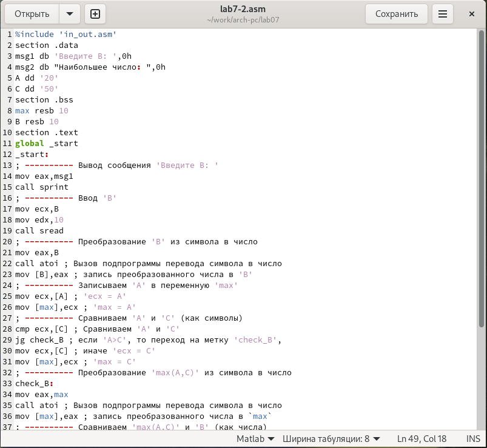{#fig:014 width=70%}

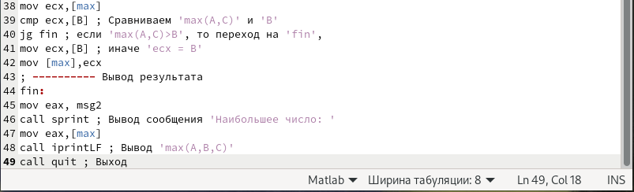{#fig:015 width=70%}

Создаю исполняемый файл и запускаю его. Проверяю работу исполняемого файла для значения B равного 10 (рис. [-@fig:016]), B равного 30 (рис. [-@fig:017]) и B равного 60 (рис. [-@fig:018]). Убеждаюсь в том, что программа корректно выводит на экран наибольшую из 3 целочисленных переменных: A,B и C. 

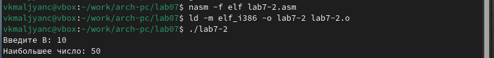{#fig:016 width=70%}

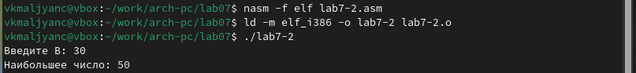{#fig:017 width=70%}

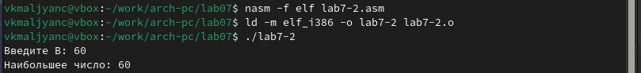{#fig:018 width=70%}

## Изучение структуры файлы листинга

Создаю файл листинга для программы из файла lab7-2.lst, указав ключ -l и задав имя файла листинга в командной строке (рис. [-@fig:019])

{#fig:019 width=70%}

Открываю файл lab7-2.lst в текстовом редакторе mcedit через терминал (рис. [-@fig:020]).

{#fig:020 width=70%}

Объяснение содержимого трех строк файла листинга:

1. Строка под номером 15 (рис. [-@fig:021]). Первое значение - номер строки (15), второе вхождение - адрес (000000ED), третье вхождение - машинный код (E81DFFFFFF, из которого E8 - префикс команды call, 1DFFFFFF - смещение до адреса подпрограммы sprint), четвертое вхождение - инструкция (call sprint - команда, которая вызывает функцию sprint).

{#fig:021 width=70%}

2. Строка под номером 19 (рис. [-@fig:022]). Первое значение - номер строки (19), второе вхождение - адрес (000000FC), третье вхождение - машинный код (E842FFFFFF, из которого E8 - префикс команды call, 42FFFFFF - смещение до адреса подпрограммы sread), четвертое вхождение - инструкция (call sread - команда, которая вызывает функцию sread).

{#fig:022 width=70%}

3. Строка под номером 22 (рис. [-@fig:023]). Первое значение - номер строки (22), второе вхождение - адрес (00000106), третье вхождение - машинный код (E891FFFFFF, из которого E8 - префикс команды call, 91FFFFFF - смещение до адреса подпрограммы atoi), четвертое вхождение - инструкция (call atoi - команда, которая вызывает функцию atoi).

{#fig:023 width=70%}

Открываю файл lab7-2.asm в текстовом редакторе gedit через терминал (рис. [-@fig:024]).

{#fig:024 width=70%}

Удаляю из строки 38 операнд [max] (рис. [-@fig:025]). 

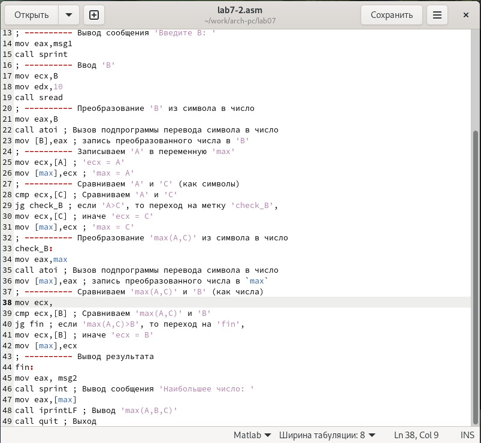{#fig:025 width=70%}

Выполняю трансляцию с получением файла листинга (рис. [-@fig:026]). Никакие выходные файла кроме листинга не создаются.

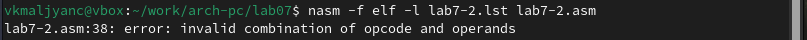{#fig:026 width=70%}

Открываю файл lab7-2.lst в текстовом редакторе mcedit через терминал (рис. [-@fig:027]).

{#fig:027 width=70%}

В листинге добавляется ошибка (рис. [-@fig:028]).

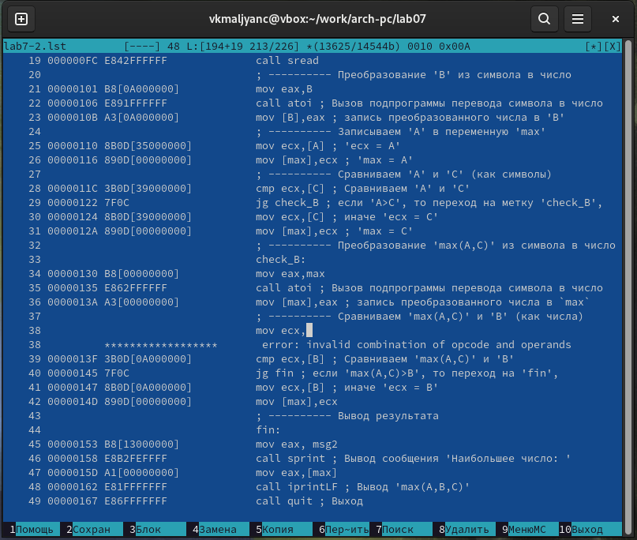{#fig:028 width=70%}

## Выполнение заданий для самостоятельной работы

Задание № 1. С помощью команды touch создаю файл lab7-3.asm (рис. [-@fig:029]).

{#fig:029 width=70%}

Открываю файл lab7-3.asm в текстовом редакторе gedit через терминал (рис. [-@fig:030]).

{#fig:030 width=70%}

Ввожу в файл lab7-3.asm программу для нахождения наименьшей из 3 целочисленных переменных a,b и c. Ввожу функцию из  варианта №1 (рис. [-@fig:031]).

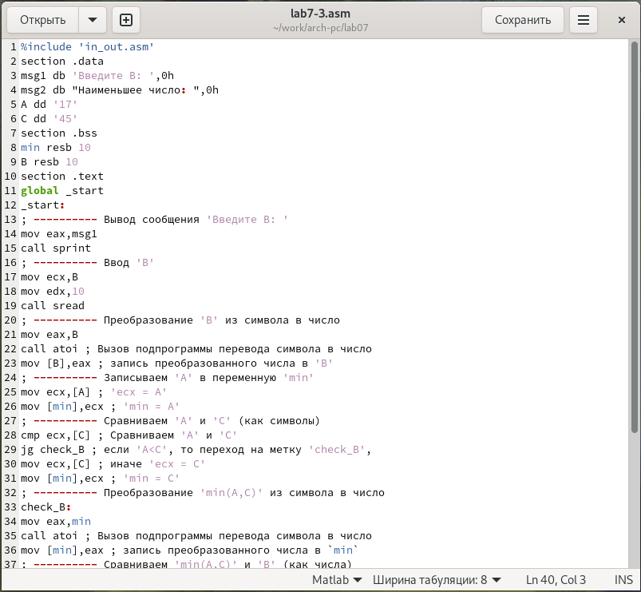{#fig:031 width=70%}

Создаю исполняемый файл и запускаю его. Задаю значение B равное 23 (рис. [-@fig:032]). Убеждаюсь в том, что результат выводится корректно.

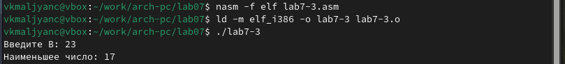{#fig:032 width=70%}


Листинг программы: 

```
%include 'in_out.asm'
section .data
msg1 db 'Введите B: ',0h
msg2 db "Наименьшее число: ",0h
A dd '17'
C dd '45'
section .bss
min resb 10
B resb 10
section .text
global _start
_start:
; ---------- Вывод сообщения 'Введите B: '
mov eax,msg1
call sprint
; ---------- Ввод 'B'
mov ecx,B
mov edx,10
call sread
; ---------- Преобразование 'B' из символа в число
mov eax,B
call atoi ; Вызов подпрограммы перевода символа в число
mov [B],eax ; запись преобразованного числа в 'B'
; ---------- Записываем 'A' в переменную 'min'
mov ecx,[A] ; 'ecx = A'
mov [min],ecx ; 'min = A'
; ---------- Сравниваем 'A' и 'С' (как символы)
cmp ecx,[C] ; Сравниваем 'A' и 'С'
jg check_B ; если 'A<C', то переход на метку 'check_B',
mov ecx,[C] ; иначе 'ecx = C'
mov [min],ecx ; 'min = C'
; ---------- Преобразование 'min(A,C)' из символа в число
check_B:
mov eax,min
call atoi ; Вызов подпрограммы перевода символа в число
mov [min],eax ; запись преобразованного числа в `min`
; ---------- Сравниваем 'min(A,C)' и 'B' (как числа)
mov ecx,[min]
cmp ecx,[B] ; Сравниваем 'min(A,C)' и 'B'
jb fin ; если 'min(A,C)<B', то переход на 'fin',
mov ecx,[B] ; иначе 'ecx = B'
mov [min],ecx
; ---------- Вывод результата
fin:
mov eax, msg2
call sprint ; Вывод сообщения 'Наименьшее число: '
mov eax,[min]
call iprintLF ; Вывод 'min(A,B,C)'
call quit ; Выход
```

Задание № 2. С помощью команды touch создаю файл lab7-4.asm (рис. [-@fig:033]).

{#fig:033 width=70%}

Открываю файл lab7-4.asm в текстовом редакторе gedit через терминал (рис. [-@fig:034]).

{#fig:034 width=70%}

Ввожу в файл lab7-4.asm программу, которая для введенных с клавиатуры значений x и a вычисляет значение заданной функции f(x) и выводит результат вычислений. Ввожу функцию из  варианта №1 (рис. [-@fig:035]).

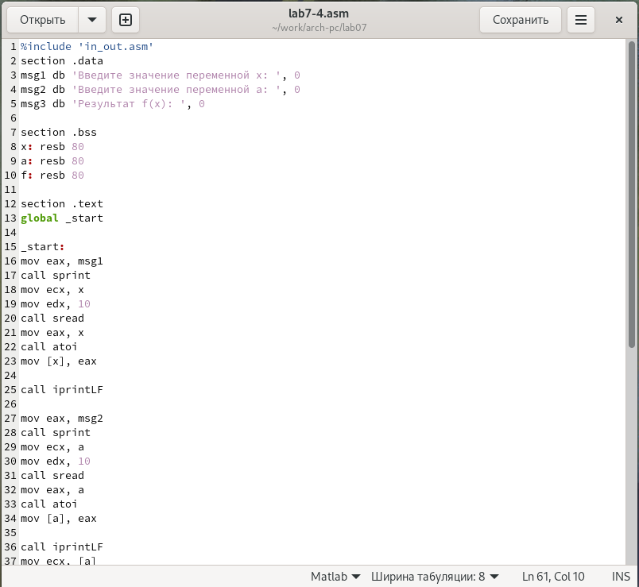{#fig:035 width=70%}

Создаю исполняемый файл и запускаю его. Проверяю работу исполняемого файла для значения x равного 1 и a равного 2 (рис. [-@fig:036]) и x равного 2 и a равного 1 (рис. [-@fig:037]). Убеждаюсь в том, что результат программы выводится корректно.

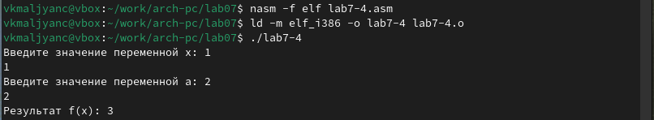{#fig:036 width=70%}

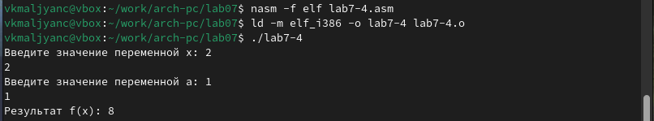{#fig:037 width=70%}

Листинг программы: 

```
%include 'in_out.asm'
section .data
msg1 db 'Введите значение переменной x: ', 0
msg2 db 'Введите значение переменной a: ', 0
msg3 db 'Результат f(x): ', 0

section .bss
x: resb 80
a: resb 80
f: resb 80

section .text
global _start

_start:
mov eax, msg1
call sprint
mov ecx, x
mov edx, 10
call sread
mov eax, x
call atoi
mov [x], eax

call iprintLF 

mov eax, msg2
call sprint
mov ecx, a
mov edx, 10
call sread
mov eax, a
call atoi
mov [a], eax

call iprintLF 
mov ecx, [a]
cmp ecx, [x]
jge less

mov edx, 8
mov [f], edx
jmp fin

less:
mov ebx, [x]
mov  ax, 2
mul ax
sub eax, ebx
mov [f], eax

fin:
mov eax, msg3
call sprint
mov eax, [f]
call iprintLF
call quit
```

# Выводы

Я изучила команды условного и безусловного переходов. Приобрела навыки написания
программ с использованием переходов. Познакомилась с назначением и структурой файла
листинга.
