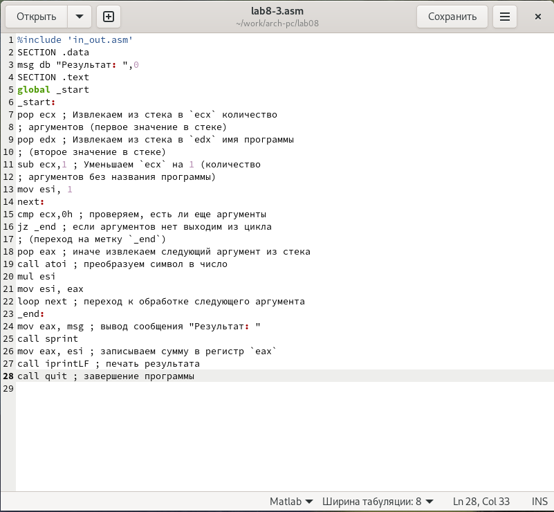

---
## Front matter
title: "Отчет по лабораторной работе №8"
subtitle: "Программирование цикла. Обработка аргументов командной строки"
author: "Мальянц Виктория Кареновна"

## Generic otions
lang: ru-RU
toc-title: "Содержание"

## Bibliography
bibliography: bib/cite.bib
csl: pandoc/csl/gost-r-7-0-5-2008-numeric.csl

## Pdf output format
toc: true # Table of contents
toc-depth: 2
lof: true # List of figures
lot: true # List of tables
fontsize: 12pt
linestretch: 1.5
papersize: a4
documentclass: scrreprt
## I18n polyglossia
polyglossia-lang:
  name: russian
  options:
	- spelling=modern
	- babelshorthands=true
polyglossia-otherlangs:
  name: english
## I18n babel
babel-lang: russian
babel-otherlangs: english
## Fonts
mainfont: IBM Plex Serif
romanfont: IBM Plex Serif
sansfont: IBM Plex Sans
monofont: IBM Plex Mono
mathfont: STIX Two Math
mainfontoptions: Ligatures=Common,Ligatures=TeX,Scale=0.94
romanfontoptions: Ligatures=Common,Ligatures=TeX,Scale=0.94
sansfontoptions: Ligatures=Common,Ligatures=TeX,Scale=MatchLowercase,Scale=0.94
monofontoptions: Scale=MatchLowercase,Scale=0.94,FakeStretch=0.9
mathfontoptions:
## Biblatex
biblatex: true
biblio-style: "gost-numeric"
biblatexoptions:
  - parentracker=true
  - backend=biber
  - hyperref=auto
  - language=auto
  - autolang=other
  - citestyle=gost-numeric
## Pandoc-crossref LaTeX customization
figureTitle: "Рис."
tableTitle: "Таблица"
listingTitle: "Листинг"
lofTitle: "Список иллюстраций"
lotTitle: "Список таблиц"
lolTitle: "Листинги"
## Misc options
indent: true
header-includes:
  - \usepackage{indentfirst}
  - \usepackage{float} # keep figures where there are in the text
  - \floatplacement{figure}{H} # keep figures where there are in the text
---

# Цель работы

Приобретение навыков написания программ с использованием циклов и обработкой
аргументов командной строки.

# Задание

1. Реализация циклов в NASM
2. Обработка аргументов командной строки
3. Выполнение задания для самостоятельной работы

# Выполнение лабораторной работы

## Реализация циклов в NASM

Создаю каталог для программ лабораторной работы № 8, перехожу в него и создаю файл lab8-1.asm (рис. [-@fig:001]).

{#fig:001 width=70%}

С помощью команды cp копирую файл in_out.asm и просматриваю содержимое каталога lab08 с помощью команды ls (рис. [-@fig:002]).

{#fig:002 width=70%}

Открываю файл lab8-1.asm в текстовом редакторе gedit через терминал (рис. [-@fig:003]).

{#fig:003 width=70%}

Ввожу в файл lab8-1.asm программу вывода значений регистра ecx (рис. [-@fig:004]).

{#fig:004 width=70%}

Создаю исполняемый файл и запускаю его. Проверяю работу исполняемого файла для значения N равного 6. Убеждаюсь в том, что программа работает корректно (рис. [-@fig:005]).

{#fig:005 width=70%}

Открываю файл lab8-1.asm в текстовом редакторе gedit через терминал (рис. [-@fig:006]).

{#fig:006 width=70%}

В тексте программы файла lab8-1.asm добавляю изменение значения регистра ecx в цикле (рис. [-@fig:007]).

{#fig:007 width=70%}

Создаю исполняемый файл и запускаю его. Проверяю работу исполняемого файла для значения N равного 6. Регистр ecx на каждой итерации уменьшается на 2 значения, количество итераций уменьшается в 2 раза, поэтому число проходов цикла не соответствует значению N, введенному с клавиатуры (рис. [-@fig:008]).

{#fig:008 width=70%}

Открываю файл lab8-1.asm в текстовом редакторе gedit через терминал (рис. [-@fig:009]).

{#fig:009 width=70%}

В тексте программы файла lab8-1.asm добавляю команды push и pop (добавления в стек и извлечения из стека) для сохранения значения счетчика цикла loop(рис. [-@fig:010]).

{#fig:010 width=70%}

Создаю исполняемый файл и запускаю его. Проверяю работу исполняемого файла для значения N равного 6. В данном случае число проходов цикла соответсвует значению N введенному с клавиатуры, но со смещением выводимых чисел на -1 (рис. [-@fig:011]).

{#fig:011 width=70%}

## Обработка аргументов командной строки

С помощью команды touch создаю файл lab8-2.asm (рис. [-@fig:012]).

{#fig:012 width=70%}

Открываю файл lab8-2.asm в текстовом редакторе gedit через терминал (рис. [-@fig:013]).

{#fig:013 width=70%}

Ввожу в файл lab8-2.asm программу, выводящую на экран аргументы командной строки (рис. [-@fig:014]).

{#fig:014 width=70%}

Создаю исполняемый файл и запускаю его. Проверяю работу исполняемого файла, указав аргументы: ргумент1 аргумент 2 'аргумент 3'. Программа обработала 4 аргумента (Аргумент 2 - 'Аргумент' и '2' - это два разных аргумента, так как они записаны через пробел) (рис. [-@fig:015]).

{#fig:015 width=70%}

С помощью команды touch создаю файл lab8-3.asm (рис. [-@fig:016]).

{#fig:016 width=70%}

Открываю файл lab8-3.asm в текстовом редакторе gedit через терминал (рис. [-@fig:017]).

{#fig:017 width=70%}

Ввожу в файл lab8-3.asm программу вычисления суммы аргументов командной строки (рис. [-@fig:018]).

{#fig:018 width=70%}

Создаю исполняемый файл и запускаю его. Проверяю работу исполняемого файла, указав аргументы: 12 13 7 10 5. Убеждаюсь в том, что программа работает корректно (рис. [-@fig:019]).

{#fig:019 width=70%}

Открываю файл lab8-3.asm в текстовом редакторе gedit через терминал (рис. [-@fig:020]).

{#fig:020 width=70%}

Изменяю текст программы файла lab8-3.asm для вычисления произведения аргументов командной строки (рис. [-@fig:021]).

{#fig:021 width=70%}

Создаю исполняемый файл и запускаю его. Проверяю работу исполняемого файла, указав аргументы: 12 13 7 10 5. Убеждаюсь в том, что программа работает корректно (рис. [-@fig:022]).

{#fig:022 width=70%}

## Выполнение задания для самостоятельной работы

С помощью команды touch создаю файл lab8-4.asm (рис. [-@fig:023]).

{#fig:023 width=70%}

Открываю файл lab8-4.asm в текстовом редакторе gedit через терминал (рис. [-@fig:024]).

{#fig:024 width=70%}

Ввожу в файл lab8-4.asm функцию из варианта №1 (рис. [-@fig:025]).

{#fig:025 width=70%}

Создаю исполняемый файл и запускаю его. Проверяю работу исполняемого файла, указав аргументы: 1 2 3 4 5 (рис. [-@fig:026]) и 1 3 5 (рис. [-@fig:027]). Убеждаюсь в том, что программа работает корректно.

{#fig:026 width=70%}

{#fig:027 width=70%}

Листинг программы: 

```
%include 'in_out.asm'

SECTION .data
msg1 db "Функция f(x)=2x+15",0
msg2 db "Результат: ",0

SECTION .text
global _start

_start:
pop ecx 
pop edx 
sub ecx,1
mov esi, 0 

next:
cmp ecx,0h 
jz _end 
pop eax 
call atoi 
mov ebx, 2
mul ebx
add eax, 15
add esi, eax

loop next

_end:
mov eax, msg1
call sprintLF
mov eax, msg2
call sprintLF
mov eax, esi 
call iprintLF 
call quit 
```

# Выводы

Я приобрела навыки написания программ с использованием циклов и обработки
аргументов командной строки.

