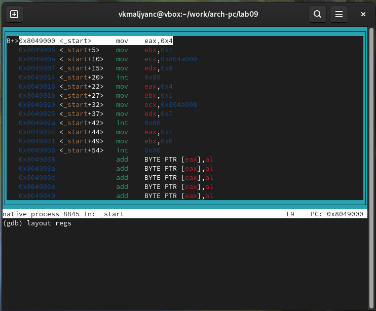
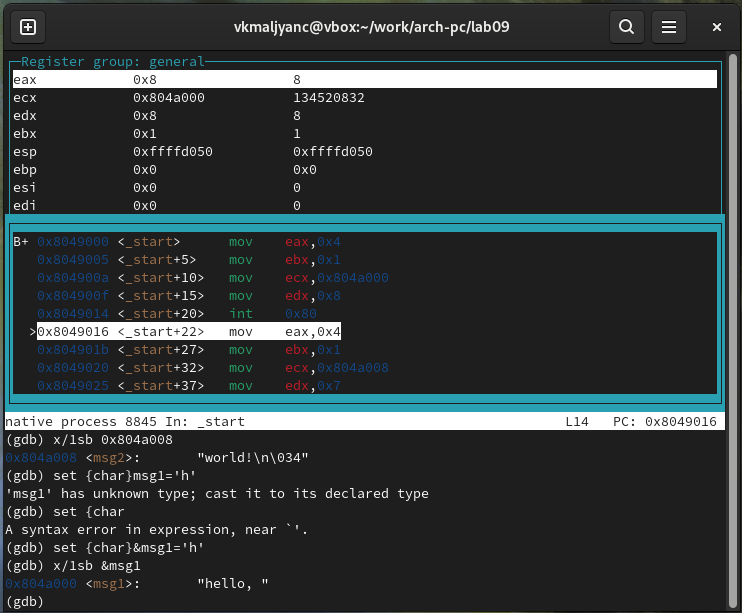

---
## Front matter
title: "Отчет по лабораторной работе №9"
subtitle: "Понятие подпрограммы. Отладчик GDB"
author: "Мальянц Виктория Кареновна"

## Generic otions
lang: ru-RU
toc-title: "Содержание"

## Bibliography
bibliography: bib/cite.bib
csl: pandoc/csl/gost-r-7-0-5-2008-numeric.csl

## Pdf output format
toc: true # Table of contents
toc-depth: 2
lof: true # List of figures
lot: true # List of tables
fontsize: 12pt
linestretch: 1.5
papersize: a4
documentclass: scrreprt
## I18n polyglossia
polyglossia-lang:
  name: russian
  options:
	- spelling=modern
	- babelshorthands=true
polyglossia-otherlangs:
  name: english
## I18n babel
babel-lang: russian
babel-otherlangs: english
## Fonts
mainfont: IBM Plex Serif
romanfont: IBM Plex Serif
sansfont: IBM Plex Sans
monofont: IBM Plex Mono
mathfont: STIX Two Math
mainfontoptions: Ligatures=Common,Ligatures=TeX,Scale=0.94
romanfontoptions: Ligatures=Common,Ligatures=TeX,Scale=0.94
sansfontoptions: Ligatures=Common,Ligatures=TeX,Scale=MatchLowercase,Scale=0.94
monofontoptions: Scale=MatchLowercase,Scale=0.94,FakeStretch=0.9
mathfontoptions:
## Biblatex
biblatex: true
biblio-style: "gost-numeric"
biblatexoptions:
  - parentracker=true
  - backend=biber
  - hyperref=auto
  - language=auto
  - autolang=other
  - citestyle=gost-numeric
## Pandoc-crossref LaTeX customization
figureTitle: "Рис."
tableTitle: "Таблица"
listingTitle: "Листинг"
lofTitle: "Список иллюстраций"
lotTitle: "Список таблиц"
lolTitle: "Листинги"
## Misc options
indent: true
header-includes:
  - \usepackage{indentfirst}
  - \usepackage{float} # keep figures where there are in the text
  - \floatplacement{figure}{H} # keep figures where there are in the text
---

# Цель работы

Приобретение навыков написания программ с использованием подпрограмм. Знакомство
с методами отладки при помощи GDB и его основными возможностями.

# Задание

1. Реализация подпрограмм в NASM
2. Отладка программам с помощью GDB
3. Добавление точек останова
4. Работа с данными программы в GDB
5. Обработка аргументов командной строки в GDB
6. Выполнение задания для самостоятельной работы

# Выполнение лабораторной работы

## Реализация подпрограмм в NASM

Создаю каталог для программ лабораторной работы № 9, перехожу в него и создаю файл lab09-1.asm (рис. [-@fig:001]).

{#fig:001 width=70%}

С помощью команды cp копирую файл in_out.asm (рис. [-@fig:002]).

{#fig:002 width=70%}

Ввожу в файл lab09-1.asm программу с использованием вызова подпрограммы (рис. [-@fig:003]).

{#fig:003 width=70%}

Создаю исполняемый файл и запускаю его. Проверяю работу исполняемого файла для значения x равного 5. Убеждаюсь в том, что программа работает корректно (рис. [-@fig:004]).

{#fig:004 width=70%}

Изменяю текст программы, добавив подпрограмму _subcalcul в подпрограмму _calcul (рис. [-@fig:005]).

{#fig:005 width=70%}

Создаю исполняемый файл и запускаю его. Проверяю работу исполняемого файла для значения x равного 5. Убеждаюсь в том, что программа работает корректно (рис. [-@fig:006]).

{#fig:006 width=70%}

Листинг программы: 

```
%include 'in_out.asm'
SECTION .data
msg: DB 'Введите x: ',0
result: DB '2(3x-1)+7=',0
SECTION .bss
x: RESB 80
res: RESB 80
SECTION .text
GLOBAL _start
_start:

mov eax, msg
call sprint
mov ecx, x
mov edx, 80
call sread
mov eax,x
call atoi
call _calcul ; Вызов подпрограммы _calcul
mov eax,result
call sprint
mov eax,[res]
call iprintLF
call quit

_calcul:
call _subcalcul
mov ebx,2
mul ebx
add eax,7
mov [res],eax
ret ; выход из подпрограммы

_subcalcul:
mov ebx, 3
mul ebx
sub eax, 1
ret
```

## Отладка программам с помощью GDB

С помощью команды touch создаю файл lab09-2.asm (рис. [-@fig:007]).

{#fig:007 width=70%}

Ввожу в файл lab09-2.asm программу вывода сообщения Hello world! (рис. [-@fig:008]).

{#fig:008 width=70%}

В исполняемом файле добавляю отладочную информацию. Провожу трансляцию программы с ключом ‘-g’ для работы с GDB (рис. [-@fig:009]).

{#fig:009 width=70%}

Загружаю исполняемый файл в отладчик GDB (рис. [-@fig:010]).

{#fig:010 width=70%}

Проверяю работу программы, запустив ее в оболочке GDB с помощью команды run. Программа работает корректно (рис. [-@fig:011]).

{#fig:011 width=70%}

Устанавливаю брейкпоинт на метку _start и запускаю программу (рис. [-@fig:012]).

{#fig:012 width=70%}

Смотрю дисассимилированный код программы с помощью команды disassemble, начиная с метки _start (рис. [-@fig:013]).

{#fig:013 width=70%}

Переключаю на отображение команд с Intel’овским синтаксисом, введя команду set disassembly-flavor intel (рис. [-@fig:014]).

{#fig:014 width=70%}

Различия отображения синтаксиса машинных команд в режимах ATT и Intel:
1. Различный порядок операндов (в ATT операнды записываются в порядке источник, назначение, в Intel перанды записываются в порядке назначение, источник)
2. Различия в именах регистров (в ATT регистры обозначаются с префиксом %, в Intel регистры обозначаются без префикса)
3. Различный размер (в ATT размер данных указывается с помощью суфиксов, в Intel размер данных определяется контекстом команды)

Включаю режим псевдографики для более удобного анализа программы (рис. [-@fig:015]) (рис. [-@fig:016]) (рис. [-@fig:017]).

{#fig:015 width=70%}

{#fig:016 width=70%}

{#fig:017 width=70%}

## Добавление точек останова

Проверяю наличие точки останова по имени метки (_start) с помощью команды info breakpoints. Точка останова существует (рис. [-@fig:018]).

{#fig:018 width=70%}

Определяю адрес предпоследней инструкции (mov ebx,0x0) и устанавливаю точку останова (рис. [-@fig:019]).

{#fig:019 width=70%}

Просматриваю информацию о всех установленных точках останова (рис. [-@fig:020]).

{#fig:020 width=70%}

## Работа с данными программы в GDB

Выполняю 5 инструкций с помощью команды stepi. Изменяются значения регистров: eax, ebx, ecx, edx (рис. [-@fig:021]) (рис. [-@fig:022]) (рис. [-@fig:023]) (рис. [-@fig:024]) (рис. [-@fig:025]).

{#fig:021 width=70%}

{#fig:022 width=70%}

{#fig:023 width=70%}

{#fig:024 width=70%}

{#fig:025 width=70%}

Просматриваю содержимое регистров с помощью команды info registers (рис. [-@fig:026]) (рис. [-@fig:027]).

{#fig:026 width=70%}

{#fig:027 width=70%}

Просматриваю значение переменной msg1 по имени и переменной msg2 по адресу (рис. [-@fig:028]).

{#fig:028 width=70%}


Изменяю первый символ переменной msg1 с помощью команды set (рис. [-@fig:029]).

{#fig:029 width=70%}

Изменяю первый символ переменной msg2 с помощью команды set (рис. [-@fig:030]).

{#fig:030 width=70%}

Вывожу в различных форматах (в шестнадцатеричном формате, в двоичном формате и
в символьном виде) значение регистра edx (рис. [-@fig:031]).

{#fig:031 width=70%}

С помощью команды set изменяю значение регистра ebx (рис. [-@fig:032]).

{#fig:032 width=70%}

Разница вывода команд p/s $ebx: при введении команды p/s $ebx='2' вывод 50, так как в программе '2' рассматривается как символ, в ASCII равен 50, при введении команды p/s $ebx=2 вывод 2, так как введено число.

## Обработка аргументов командной строки в GDB

Копирую файл lab8-2.asm в файл с именем lab09-3.asm рис. [-@fig:033]).

{#fig:033 width=70%}

Создаю исполняемый файл [-@fig:034]).

{#fig:034 width=70%}

Загружаю исполняемый файл с использованием ключа --args в отладчик, указав аргументы [-@fig:035]).

{#fig:035 width=70%}

Устанавливаю точку останова перед первой инструкцией в программе и запускаю ее [-@fig:036]).

{#fig:036 width=70%}

Просмотриваю позиции стека [-@fig:037]).

{#fig:037 width=70%}

Шаг изменения адреса равен 4, потому что каждый элемент стека занимает 4 байта.

## Выполнение задания для самостоятельной работы

1. 
С помощью команды touch создаю файл lab09-4.asm (рис. [-@fig:038]).

{#fig:038 width=70%}

Преобразовываю программу из лабораторной работы №8 (Задание №1 для самостоятель-
ной работы), реализовав вычисление значения функции f(x) как подпрограмму (рис. [-@fig:039]).

{#fig:039 width=70%}

Создаю исполняемый файл и запускаю его. Проверяю работу исполняемого файла, указав аргументы: 1 2 3 4 5 (рис. [-@fig:040]). Убеждаюсь в том, что программа работает корректно.

{#fig:040 width=70%}

Листинг программы: 

```
%include 'in_out.asm'

SECTION .data
msg1 db "Функция f(x)=2x+15",0
msg2 db "Результат: ",0

SECTION .text
global _start

_start:
pop ecx 
pop edx 
sub ecx,1
mov esi, 0 

next:
cmp ecx,0h 
jz _end 
pop eax 
call atoi 
call _calcul_
loop next

_end:
mov eax, msg1
call sprintLF
mov eax, msg2
call sprintLF
mov eax, esi 
call iprintLF 
call quit 

_calcul_:
mov ebx, 2
mul ebx
add eax, 15
add esi, eax
ret
```

2. 
С помощью команды touch создаю файл lab09-5.asm (рис. [-@fig:041]).

{#fig:041 width=70%}

Ввожу в файл lab09-5.asm программу вычисления выражения (3+2)*4+5 (рис. [-@fig:042]).

{#fig:042 width=70%}

Создаю исполняемый файл и запускаю его. Проверяю работу исполняемого файла и убеждаюсь в том, что программа работает некорректно (рис. [-@fig:043]).

{#fig:043 width=70%}

В исполняемом файле добавляю отладочную информацию. Провожу трансляцию программы с ключом ‘-g’ для работы с GDB. Загружаю исполняемый файл в отладчик GDB (рис. [-@fig:044]).

{#fig:044 width=70%}

Устанавливаю брейкпоинт на метку _start и запускаю программу (рис. [-@fig:045]).

{#fig:045 width=70%}

Включаю режим псевдографики для более удобного анализа программы. С помощью команды stepi просматриваю значения регистров. В программе сумму eax и ebx записывали в ebx, но так как mul ecx умножает eax на ecx и записывает результат в eax, то на ecx умножилась не сумма eax и ebx, а eax, поэтому при выполнении mul ecx значение регистра ebx не изменилось (рис. [-@fig:046]) (рис. [-@fig:047]).

{#fig:046 width=70%}

{#fig:047 width=70%}

Изменяю текст программы, чтобы она работала корректно (рис. [-@fig:048]).

{#fig:048 width=70%}

Создаю исполняемый файл и запускаю его. Проверяю работу исполняемого файла и убеждаюсь в том, что программа работает корректно (рис. [-@fig:049]).

{#fig:049 width=70%}

Листинг программы: 

```
%include 'in_out.asm'
SECTION .data
div: DB 'Результат: ',0
SECTION .text
GLOBAL _start
_start:
; ---- Вычисление выражения (3+2)*4+5
mov ebx,3
mov eax,2
add eax,ebx
mov ecx,4
mul ecx
add eax,5
mov edi,eax
; ---- Вывод результата на экран
mov eax,div
call sprint
mov eax,edi
call iprintLF
call quit
```

# Выводы

Я приобрела навыки написания программ с использованием подпрограмм. Познакомилась с методами отладки при помощи GDB и его основными возможностями.

