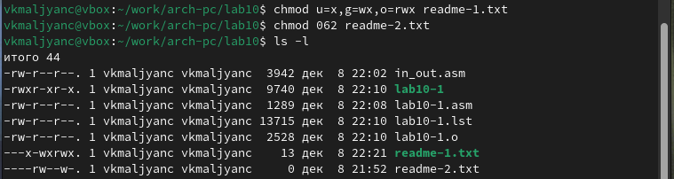

---
## Front matter
title: "Отчет по лабораторной работе №10"
subtitle: "Работа с файлами средствами Nasm"
author: "Мальянц Виктория Кареновна"

## Generic otions
lang: ru-RU
toc-title: "Содержание"

## Bibliography
bibliography: bib/cite.bib
csl: pandoc/csl/gost-r-7-0-5-2008-numeric.csl

## Pdf output format
toc: true # Table of contents
toc-depth: 2
lof: true # List of figures
lot: true # List of tables
fontsize: 12pt
linestretch: 1.5
papersize: a4
documentclass: scrreprt
## I18n polyglossia
polyglossia-lang:
  name: russian
  options:
	- spelling=modern
	- babelshorthands=true
polyglossia-otherlangs:
  name: english
## I18n babel
babel-lang: russian
babel-otherlangs: english
## Fonts
mainfont: IBM Plex Serif
romanfont: IBM Plex Serif
sansfont: IBM Plex Sans
monofont: IBM Plex Mono
mathfont: STIX Two Math
mainfontoptions: Ligatures=Common,Ligatures=TeX,Scale=0.94
romanfontoptions: Ligatures=Common,Ligatures=TeX,Scale=0.94
sansfontoptions: Ligatures=Common,Ligatures=TeX,Scale=MatchLowercase,Scale=0.94
monofontoptions: Scale=MatchLowercase,Scale=0.94,FakeStretch=0.9
mathfontoptions:
## Biblatex
biblatex: true
biblio-style: "gost-numeric"
biblatexoptions:
  - parentracker=true
  - backend=biber
  - hyperref=auto
  - language=auto
  - autolang=other
  - citestyle=gost-numeric
## Pandoc-crossref LaTeX customization
figureTitle: "Рис."
tableTitle: "Таблица"
listingTitle: "Листинг"
lofTitle: "Список иллюстраций"
lotTitle: "Список таблиц"
lolTitle: "Листинги"
## Misc options
indent: true
header-includes:
  - \usepackage{indentfirst}
  - \usepackage{float} # keep figures where there are in the text
  - \floatplacement{figure}{H} # keep figures where there are in the text
---

# Цель работы

Приобретение навыков написания программ для работы с файлами.

# Задание

1. Программа записи в файл сообщения, применение команды chmod
2. Выполнение задания для самостоятельной работы

# Выполнение лабораторной работы

## Программа записи в файл сообщения, применение команды chmod

Создаю каталог для программ лабораторной работы № 10, перехожу в него и создаю файлы lab10-1.asm, readme-1.txt и readme-2.txt (рис. [-@fig:001]).

{#fig:001 width=70%}

С помощью команды cp копирую файл in_out.asm (рис. [-@fig:002]).

{#fig:002 width=70%}

Ввожу в файл lab10-1.asm программу записи в файл сообщения (рис. [-@fig:003]).

{#fig:003 width=70%}

Создаю исполняемый файл и запускаю его. Убеждаюсь в том, что программа работает корректно (рис. [-@fig:004]).

{#fig:004 width=70%}

С помощью команды chmod изменяю права доступа к исполняемому файлу lab10-1,
запретив его выполнение. Пытаюсь выполнить файл, но отказано в доступе, так как я запретила доступ к исполнению программы. (рис. [-@fig:005]).

{#fig:005 width=70%}

С помощью команды chmod изменяю права доступа к файлу lab10-1.asm с исходным
текстом программы, добавив права на исполнение. Пытаюсь выполнить его, программа не запускается, так как я запускаю файл с исходным текстом программы, а не исполняемый файл (рис. [-@fig:006]).

{#fig:006 width=70%}

В соответствии с вариантом № 1 предоставляю права доступа к файлу readme-1.txt представленные в символьном виде, а для файла readme-2.txt – в двоичном виде.
Проверяю правильность выполнения с помощью команды ls -l (рис. [-@fig:007]).

{#fig:007 width=70%}

## Выполнение задания для самостоятельной работы

С помощью команды touch создаю файл lab10-2.asm (рис. [-@fig:008]).

{#fig:008 width=70%} 

С помощью команды touch создаю файл name.txt (рис. [-@fig:009]).

{#fig:009 width=70%} 

Пишу программу, работающую по следующему алгоритму:
• Вывод приглашения “Как Вас зовут?”
• ввести с клавиатуры свои фамилию и имя
• создать файл с именем name.txt
• записать в файл сообщение “Меня зовут”
• дописать в файл строку введенную с клавиатуры
• закрыть файл
Создаю исполняемый файл и проверяю его работу. Проверяю наличие файла и его
содержимое с помощью команд ls и cat (рис. [-@fig:010]).

{#fig:010 width=70%}

Создаю исполняемый файл и запускаю его. Проверяю работу исполняемого файла. Убеждаюсь в том, что программа работает корректно (рис. [-@fig:011]).

{#fig:011 width=70%}

Листинг программы: 

```
%include 'in_out.asm'
SECTION .data
filename db 'name.txt', 0h 
q db 'Как Вас зовут? ', 0h 
a db 'Меня зовут ', 0h
SECTION .bss
name_surname resb 255 
SECTION .text
global _start
_start:
mov eax,q
call sprint
mov ecx, name_surname
mov edx, 255
call sread
mov ecx, 0777o
mov ebx, filename
mov eax, 8
int 80h
mov esi, eax
mov eax, a
call slen 
mov edx, eax
mov ecx, a
mov ebx, esi
mov eax, 4
int 80h
mov eax, name_surname
call slen 
mov edx, eax
mov ecx, name_surname
mov ebx, esi
mov eax, 4
int 80h
mov ebx, esi
mov eax, 6
int 80h
call quit
```

# Выводы

Я приобрела навыки написания программ для работы с файлами.
